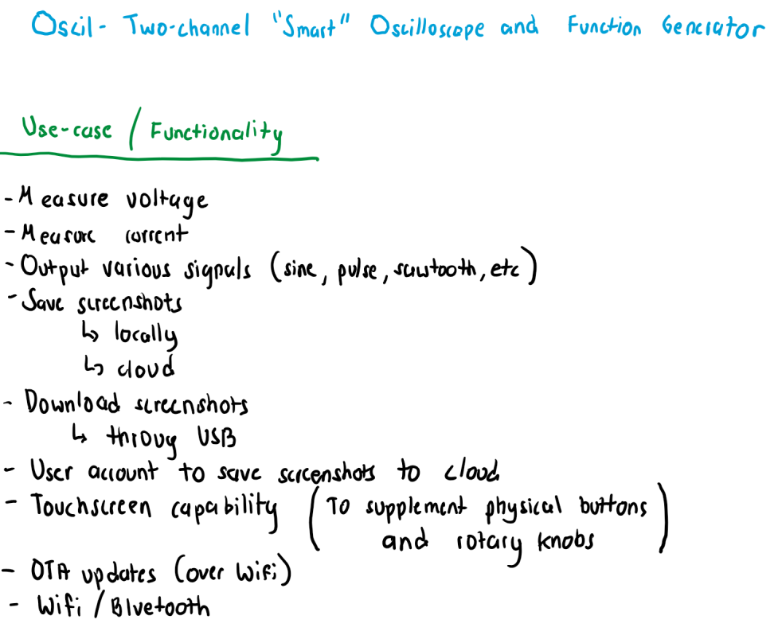
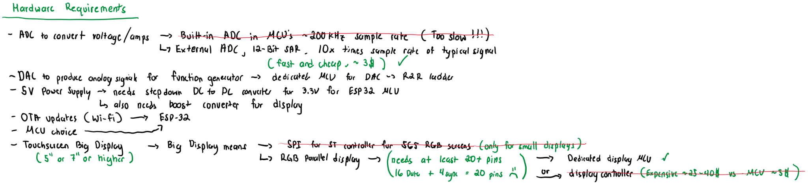
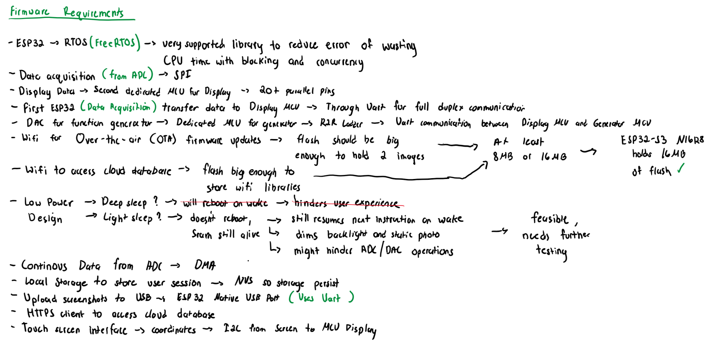
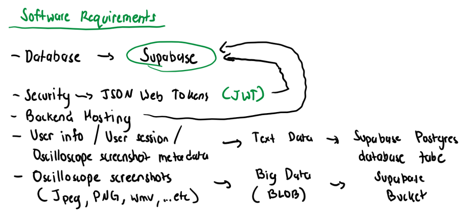
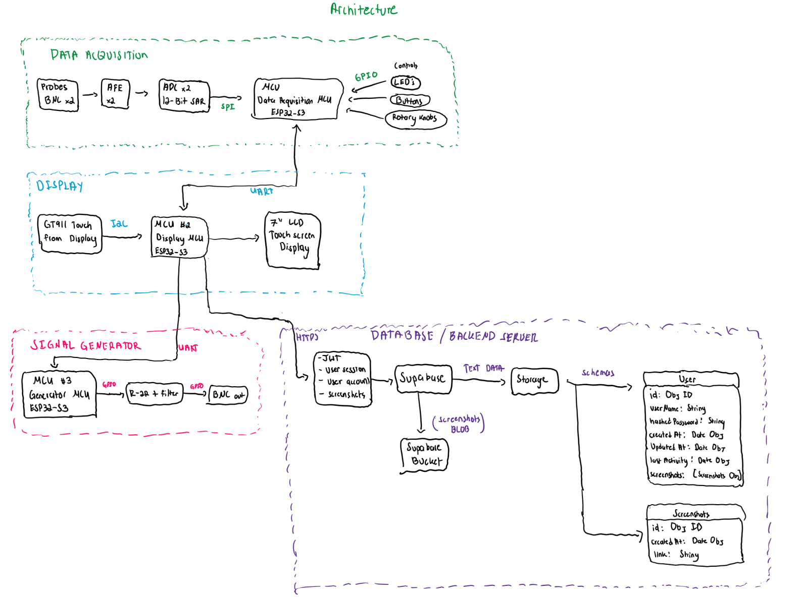

# Oscil

**Two-channel "smart" oscilloscope and function generator**

ESP32-S3 · ESP-IDF · FreeRTOS · Supabase

> **Rev 0.1 — design phase.** Requirements and architecture are drafted; hardware is on order. Nothing is built yet.

---

## Contents

- [Use cases / functionality](#use-cases--functionality)
- [Hardware requirements](#hardware-requirements)
- [Firmware requirements](#firmware-requirements)
- [Software requirements](#software-requirements)
- [Architecture](#architecture)
- [Design documents](#design-documents)

---

## Use cases / functionality

What a user can do with Oscil.

---

## Hardware requirements

What the hardware must provide, and why the external ADC and dedicated display MCU were chosen.

---

## Firmware requirements

How the three ESP32-S3s acquire, display, generate, and communicate.

---

## Software requirements

The cloud side: accounts, screenshot metadata, and file storage on Supabase.

---

## Architecture

Three ESP32-S3 boards (acquisition, display, generator) linked over UART, with Supabase as the backend.

---

## Design documents

| Document | Description |
|---|---|
| [`design_v0.pdf`](design_v0.pdf) | Full design, all sections on one document |
| [`Oscil_bill_of_materials_bom.xlsx`](Oscil_bill_of_materials_bom.xlsx) | Bill of materials |

PNG versions of each diagram are in [`screenshots/`](screenshots/).

---

## Revision history

| Rev | Date | Change |
|---|---|---|
| 0.1 | 2026-09-16 | Initial design: use cases, requirements, architecture. Nothing built. |

---

Built by [Paul Simbulan](https://paulsimbulan.com)