# Firmware build log

## 2026-09-21

Started firmware. Three ESP-IDF projects, one per board, plus a shared
folder so pin numbers and the link protocol only exist once.

## 2026-09-22

sdkconfig.defaults in each: 16MB flash, octal PSRAM, 1000 Hz tick,
console on USB Serial/JTAG. The 2MB and 100 Hz defaults both bit me
in earlier lab work, so each build gets checked against sdkconfig.

Pin numbers from pin-map.md are in a header per board. Firmware
never uses a raw GPIO number.

AFE scaling in shared. The divider bottom sits on 2.2 V instead of
ground, so 0 V at the BNC reads 1.65 V at the ADC. Vbnc = 4 x (Vadc - 1.65).

First build couldn't find oscil_pins_acq.h. An include path would've
found the header but not compiled the .c, so shared is a real component
now. Also caught display and gen still named project(acq).

Host tests with Unity run the real oscil_afe.c on my PC. 4/4 pass.
They check the math, not the hardware. CI runs them on every push
that touches firmware, and the badge on the README shows the result.

Status LED heartbeat on all three boards. GPIO goes through registers
in oscil_gpio.h, no driver. The WS2812 is bit-banged off the CPU cycle
counter: 24 bits GRB, 0.4 or 0.85 us high in a 1.25 us bit, interrupts
masked for the ~30 us frame. Blink task pinned to core 0.
Acq green, display red, gen blue.

First build died on -Werror=misleading-indentation. A `while (...);`
wait loop with the next line one space off. Empty loops get `{ }` now.
First flash wasn't one either: only the monitor ran, and board 1 was
still booting an old lab.

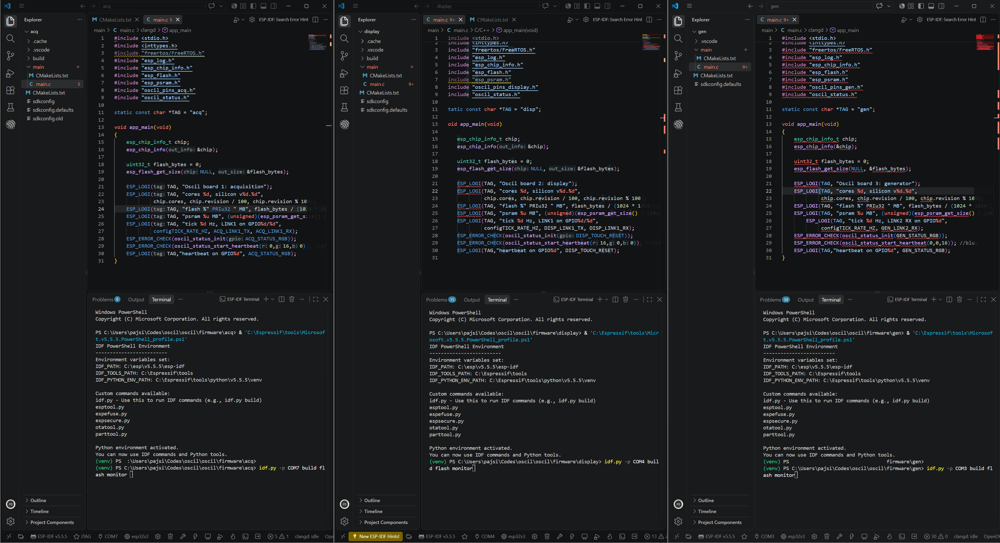

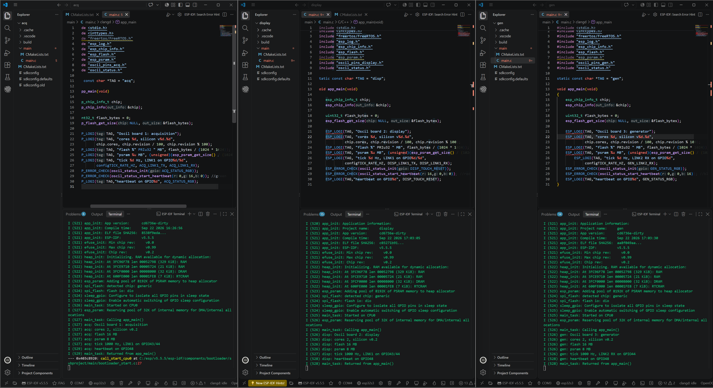

[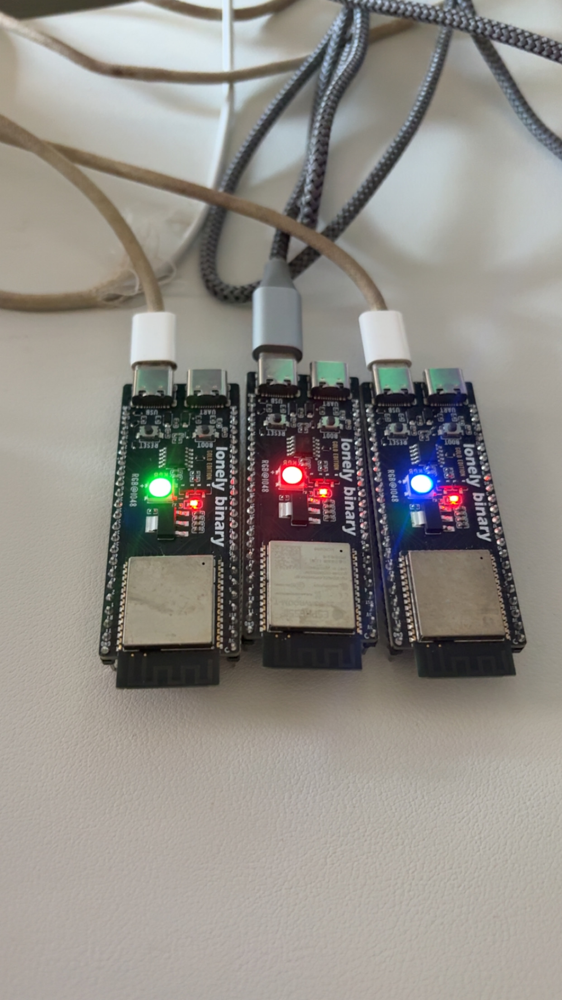](screenshots_videos/heartbeat_3_mcus.MP4)

Pin walk on board 1. The first pin in the list pulses once, the second
twice, and so on, then every pin is read back with the pull-up on.
26 pins, four batches of eight on the logic analyzer, every count
matched the schematic header. GPIO43 and 44 are the TX and RX pads
on the silkscreen, not numbered.

First read pass came back with random 0s. I was reading right after
turning on the 45k pull-up, and the pin had just been driven low, so it
hadn't charged yet. Pull-ups on for everything, 10 ms settle, then read:
all 1s every pass.

Each batch: analyzer GND to header 22, D0 to D7 on eight header pins,
1 MHz capture. Counting the pulses on a channel tells you which GPIO
is on that pin.

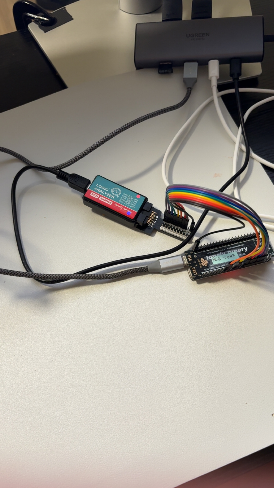

Batch 1:

| Ch | Header | GPIO | Signal | Pulses | Seen |
|---|---|---|---|---|---|
| D0 | 4 | 4 | ENC1_A | 1 | ✓ |
| D1 | 5 | 5 | ENC1_B | 2 | ✓ |
| D2 | 6 | 6 | ENC1_SW | 3 | ✓ |
| D3 | 7 | 7 | ENC2_A | 4 | ✓ |
| D4 | 12 | 8 | ENC2_B | 5 | ✓ |
| D5 | 15 | 9 | ENC2_SW | 6 | ✓ |
| D6 | 8 | 15 | CH2_SCLK | 7 | ✓ |
| D7 | 9 | 16 | CH2_SDO | 8 | ✓ |

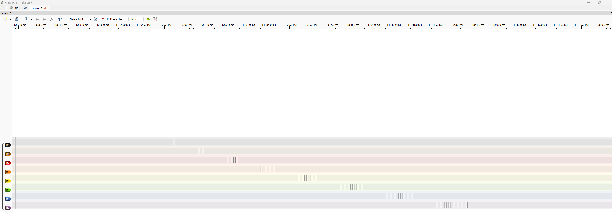

Batch 2:

| Ch | Header | GPIO | Signal | Pulses | Seen |
|---|---|---|---|---|---|
| D0 | 10 | 17 | CH2_CS | 9 | ✓ |
| D1 | 16 | 10 | CH1_CS | 10 | ✓ |
| D2 | 11 | 18 | ENC3_A | 11 | ✓ |
| D3 | 18 | 12 | CH1_SCLK | 12 | ✓ |
| D4 | 19 | 13 | CH1_SDO | 13 | ✓ |
| D5 | 27 | 21 | ENC3_B | 14 | ✓ |
| D6 | 35 | 38 | ENC3_SW | 15 | ✓ |
| D7 | 36 | 39 | BTN_RUN | 16 | ✓ |

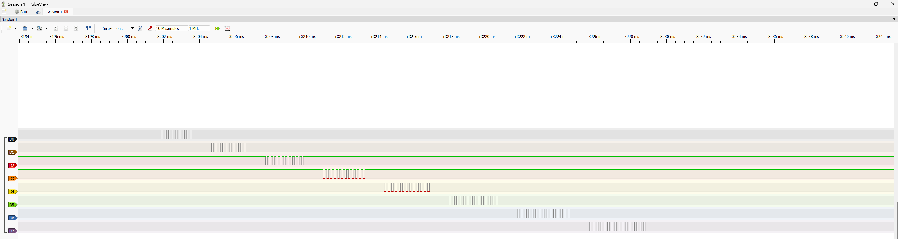

Batch 3:

| Ch | Header | GPIO | Signal | Pulses | Seen |
|---|---|---|---|---|---|
| D0 | 37 | 40 | BTN_SINGLE | 17 | ✓ |
| D1 | 38 | 41 | BTN_GEN | 18 | ✓ |
| D2 | 39 | 42 | LED_RUN | 19 | ✓ |
| D3 | 28 | 47 | LED_TRIG | 20 | ✓ |
| D4 | 41 | 1 | LED_ARM | 21 | ✓ |
| D5 | 43 (TX) | 43 | LINK1_TX | 22 | ✓ |
| D6 | 42 (RX) | 44 | LINK1_RX | 23 | ✓ |
| D7 | 40 | 2 | spare | 24 | ✓ |

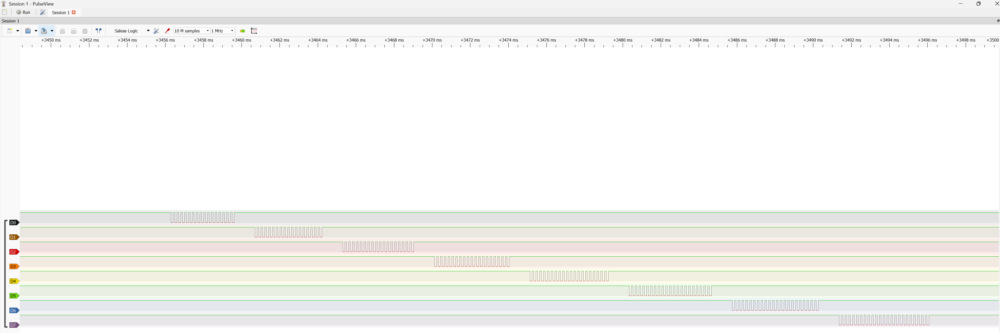

Batch 4:

| Ch | Header | GPIO | Signal | Pulses | Seen |
|---|---|---|---|---|---|
| D0 | 17 | 11 | spare | 25 | ✓ |
| D1 | 20 | 14 | spare | 26 | ✓ |

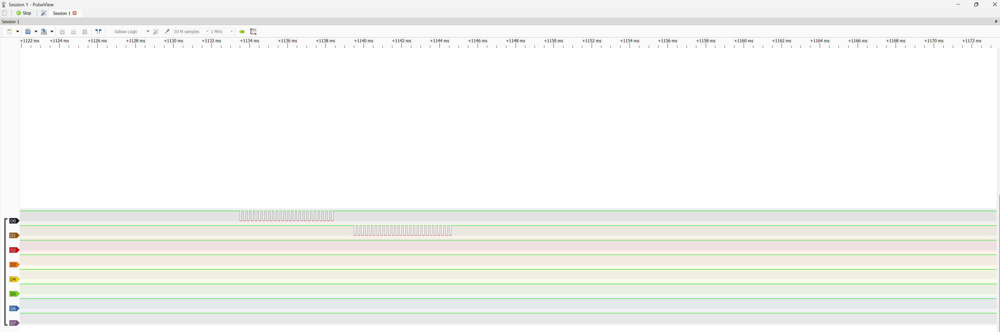

Pin walk on board 2. Same 26-pin idea, same header order as board 1, so
the analyzer wiring for each batch didn't change between boards. Every
count matched. GPIO48 stays off the list: it's the status LED now and
the touch reset later, so it gets checked when the touch panel goes on.

Batch 1:

| Ch | Header | GPIO | Signal | Pulses | Seen |
|---|---|---|---|---|---|
| D0 | 4 | 4 | LCD_R5 | 1 | ✓ |
| D1 | 5 | 5 | LCD_R6 | 2 | ✓ |
| D2 | 6 | 6 | LCD_R7 | 3 | ✓ |
| D3 | 7 | 7 | LCD_G2 | 4 | ✓ |
| D4 | 12 | 8 | LCD_G3 | 5 | ✓ |
| D5 | 15 | 9 | LCD_G4 | 6 | ✓ |
| D6 | 8 | 15 | LCD_B5 | 7 | ✓ |
| D7 | 9 | 16 | LCD_B6 | 8 | ✓ |

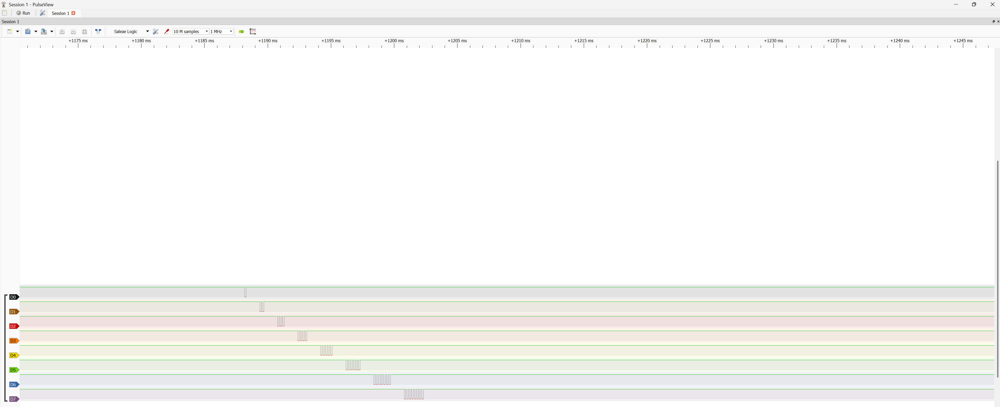

Batch 2:

| Ch | Header | GPIO | Signal | Pulses | Seen |
|---|---|---|---|---|---|
| D0 | 10 | 17 | LCD_B7 | 9 | ✓ |
| D1 | 16 | 10 | LCD_G5 | 10 | ✓ |
| D2 | 11 | 18 | LCD_DCLK | 11 | ✓ |
| D3 | 18 | 12 | LCD_G7 | 12 | ✓ |
| D4 | 19 | 13 | LCD_B3 | 13 | ✓ |
| D5 | 27 | 21 | LCD_HSYNC | 14 | ✓ |
| D6 | 35 | 38 | LCD_VSYNC | 15 | ✓ |
| D7 | 36 | 39 | LCD_DE | 16 | ✓ |

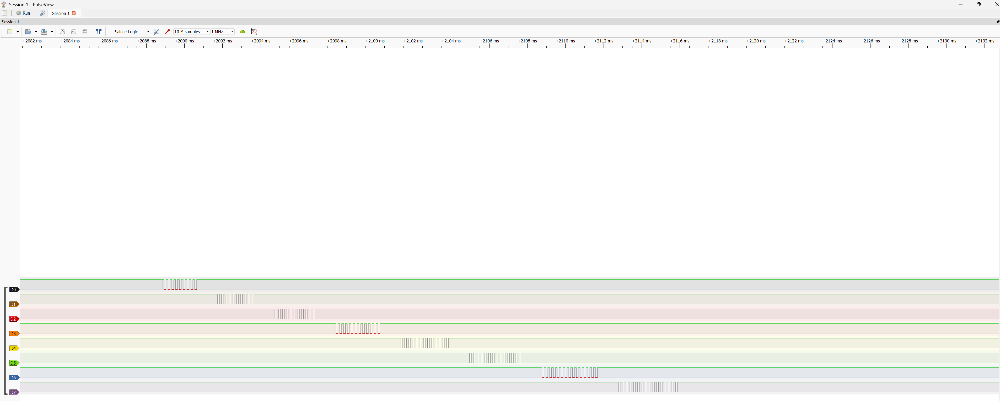

Batch 3:

| Ch | Header | GPIO | Signal | Pulses | Seen |
|---|---|---|---|---|---|
| D0 | 37 | 40 | TOUCH_SDA | 17 | ✓ |
| D1 | 38 | 41 | TOUCH_SCL | 18 | ✓ |
| D2 | 39 | 42 | TOUCH_INT | 19 | ✓ |
| D3 | 28 | 47 | LINK2_TX | 20 | ✓ |
| D4 | 41 | 1 | LCD_R3 | 21 | ✓ |
| D5 | 43 (TX) | 43 | LINK1_TX | 22 | ✓ |
| D6 | 42 (RX) | 44 | LINK1_RX | 23 | ✓ |
| D7 | 40 | 2 | LCD_R4 | 24 | ✓ |

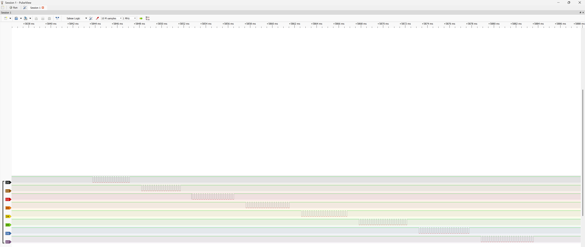

Batch 4:

| Ch | Header | GPIO | Signal | Pulses | Seen |
|---|---|---|---|---|---|
| D0 | 17 | 11 | LCD_G6 | 25 | ✓ |
| D1 | 20 | 14 | LCD_B4 | 26 | ✓ |

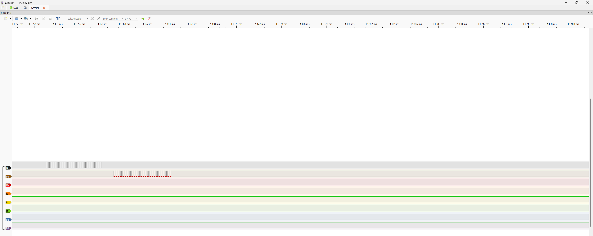

Pin walk on board 3. Only nine pins: the eight R-2R bits and LINK2's
receive line. The DAC bits are the ones that have to be exact, since
all eight get written in one store to GPIO_OUT later. All eight matched,
and LINK2_RX on the RX pad showed its 9 pulses. Pin walk done on all
three boards, 61 pins, no mismatches.

| Ch | Header | GPIO | Signal | Pulses | Seen |
|---|---|---|---|---|---|
| D0 | 4 | 4 | DAC_D0 | 1 | ✓ |
| D1 | 5 | 5 | DAC_D1 | 2 | ✓ |
| D2 | 6 | 6 | DAC_D2 | 3 | ✓ |
| D3 | 7 | 7 | DAC_D3 | 4 | ✓ |
| D4 | 12 | 8 | DAC_D4 | 5 | ✓ |
| D5 | 15 | 9 | DAC_D5 | 6 | ✓ |
| D6 | 16 | 10 | DAC_D6 | 7 | ✓ |
| D7 | 17 | 11 | DAC_D7 | 8 | ✓ |
| D0 (batch 2) | 42 (RX) | 44 | LINK2_RX | 9 | ✓ |

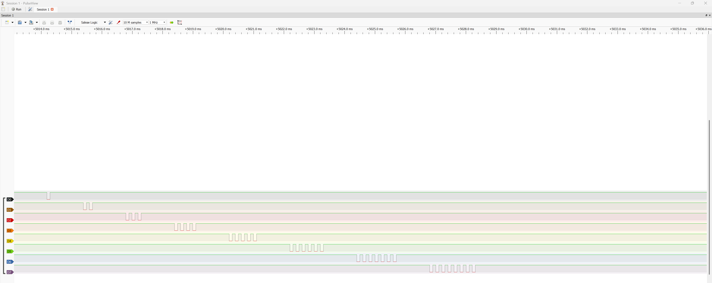

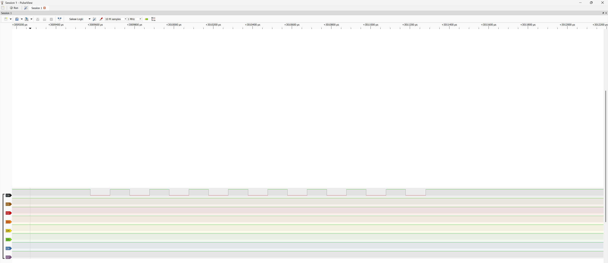

## 2026-09-23

Wrote the SPI side for the ADCs: GP-SPI2 set up straight from its
registers, no driver. Clock on, pins on the IO MUX, 80 MHz module clock
divided down, mode 1, 16 clocks per frame, single or dual line. The
fastest legal clock is 26.67 MHz (80 MHz / 3), since /2 would be 40 and
the ADS7883 tops out at 32 at 3.3 V.

Speed test is written too: times 10,000 frames on the cycle counter for
five settings and holds each for 2 s so the analyzer can catch it.
Nothing plugged in yet; the analyzer run is next.

## 2026-09-24

Ran the speed test on board 1. JTAG flashing kept failing in OpenOCD,
so flashed over UART on COM7 instead.

First run tripped the task watchdog: the 2 s hold loop spun and IDLE0
never ran. It yields every 500 frames now. The result lines also went
missing until I added a 10 ms delay after unmasking interrupts, plus
fflush.

| SCLK | Mode | Lines | Cycles/frame | ns/frame | kSa/s |
|---|---|---|---|---|---|
| 10 MHz | 1 | single | 525 | 2188 | 457 |
| 10 MHz | 1 | dual | 525 | 2188 | 457 |
| 26.67 MHz | 0 | single | 261 | 1088 | 919 |
| 26.67 MHz | 1 | single | 261 | 1088 | 919 |
| 26.67 MHz | 1 | dual | 261 | 1088 | 919 |

At 26.67 MHz the 16 clocks take 600 ns, so about 490 ns of each frame
is overhead from the CPU starting each frame. DMA fixes that later.
Dual line costs nothing, so it's Plan B: one SCLK and CS for both ADCs,
CH1 on GPIO13, CH2 on GPIO11.

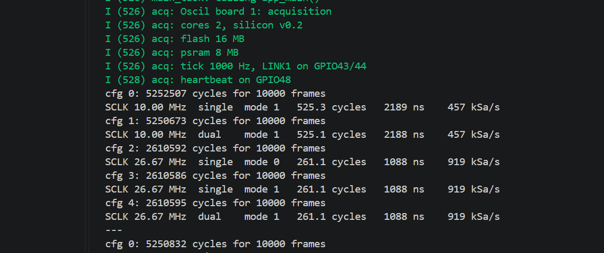

Analyzer on board 1, 24 MHz sample rate:

| Analyzer | GPIO | Signal |
|---|---|---|
| D0 | 12 | SCLK |
| D1 | 10 | CS |

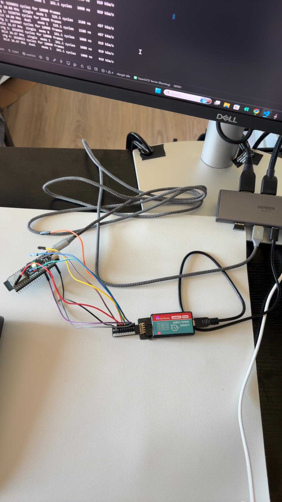

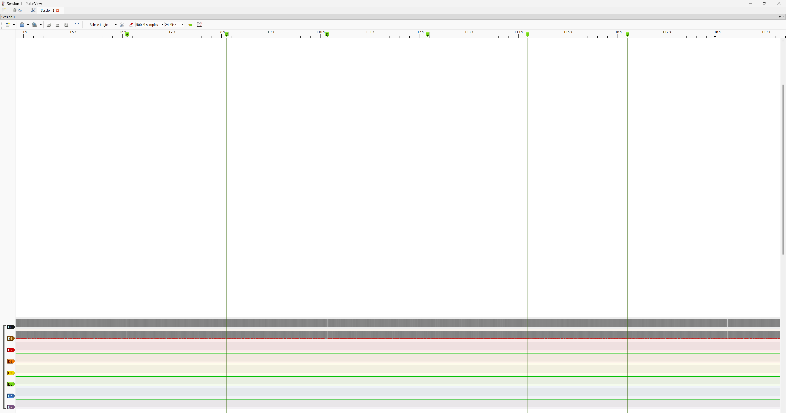

10 MHz: CS period 2208 ns, matches the 2188 from the cycle counter.
16 clocks per frame.

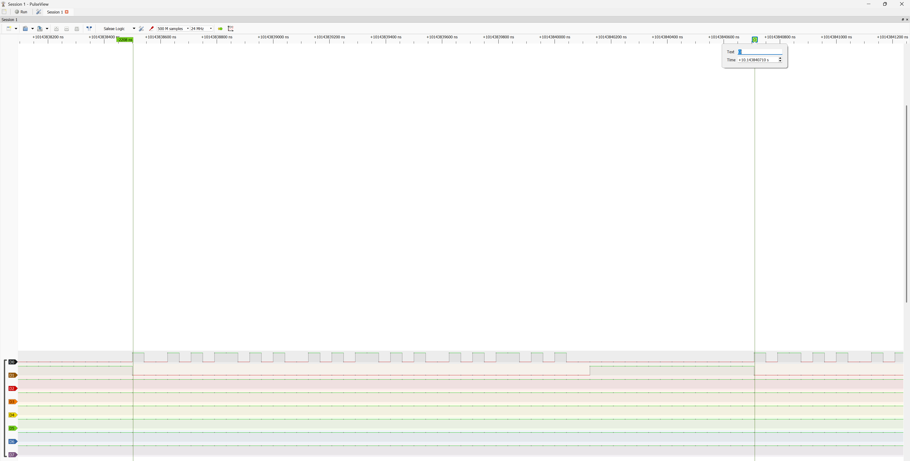

26.67 MHz: CS period 1084 ns, matches 1088. The clock itself aliases at
24 MHz sampling, so the CS period is the proof here, not the edges.

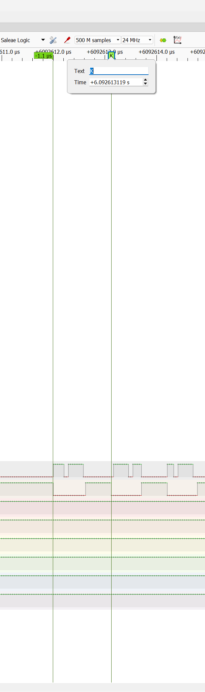

The analog rail. MCP1700 on the breadboard, 1 uF ceramics for
C1 and C2 from the MLCC kit, jumper wire for R1. Nothing else on
+3V3_A yet.

+5V comes from the ELEGOO breadboard power module for now instead of
board 1's 5V pin, so the USB backfeed check is skipped. Its USB-C input
only gave 4.648 V (passthrough plus the drops along the way). The
barrel jack goes through the module's own regulator and gives 4.987 V,
so that's what I'm using.

| Node | Reading |
|---|---|
| +5V_A (VIN) | 4.987 V |
| +3V3_A (VOUT) | 3.314 V |

3.314 V is 0.4% high, well inside the MCP1700's +/-3% spec.

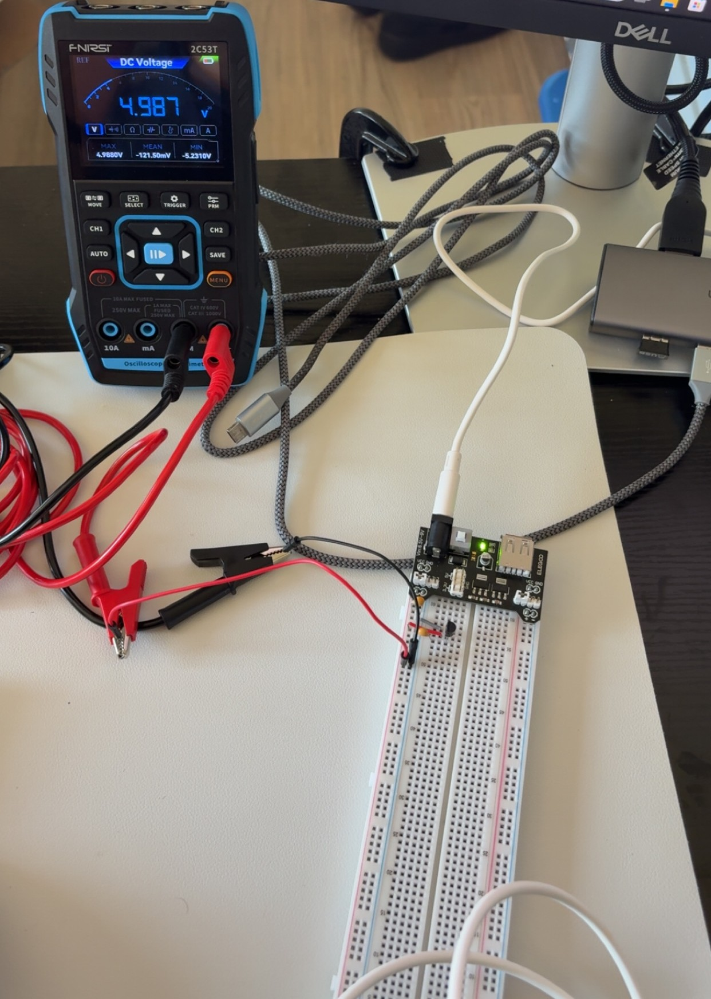

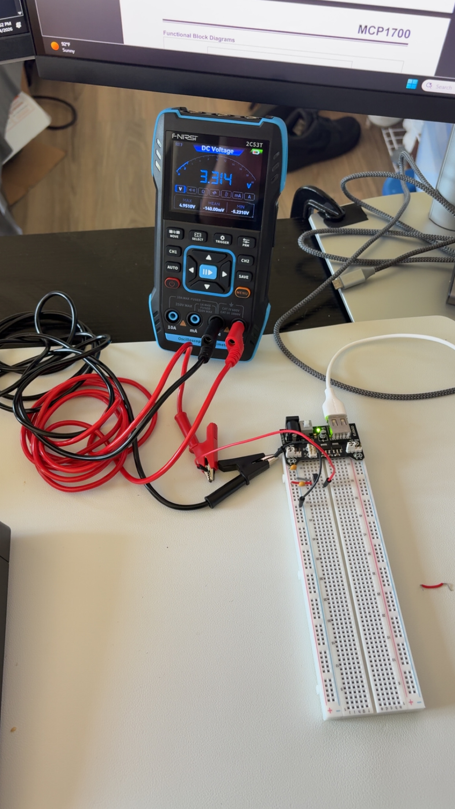

The 2.2 V reference. R2/R3 (10k/20k) off +3V3_A with C3 on
the midpoint, U2A as a unity-gain buffer, C4 right on pin 8. U2B is
parked as a follower with its input on GND, same as the schematic.

| Node | Reading |
|---|---|
| Divider (pin 3) | 2.214 V |
| VREF_2V2 (pin 1) | 2.214 V |

Expected 3.314 x 20k/30k = 2.209 V, so 5 mV off, inside 1% resistor
tolerance. Pin 1 matches pin 3, so the buffer adds nothing.

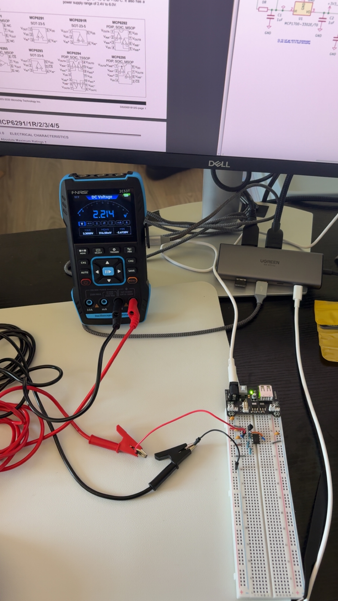

Prep for the front end: the parts that don't fit a breadboard.

BNCs (Superbat panel mount) got jumper wires soldered on: centre pin for
signal, solder lug for ground. Continuity centre to jack pin and lug to
barrel beep; centre to shell reads OL.

BAV99s are SOT-23-3, so they went on the adapter boards. Tiny and
sloppy without proper tools, but continuity passes. The adapter
silkscreen doesn't match the part:

| BAV99 pin | Job | Adapter pad |
|---|---|---|
| 1 | lower anode, to GND | 6 |
| 2 | upper cathode, to +3V3_A | 2 |
| 3 | common, to JCT | 4 |

One of the two has pins 2 and 3 bridged. That shorts the upper diode
and ties JCT straight to +3V3_A, so it's not going in until the bridge
is cleaned up.

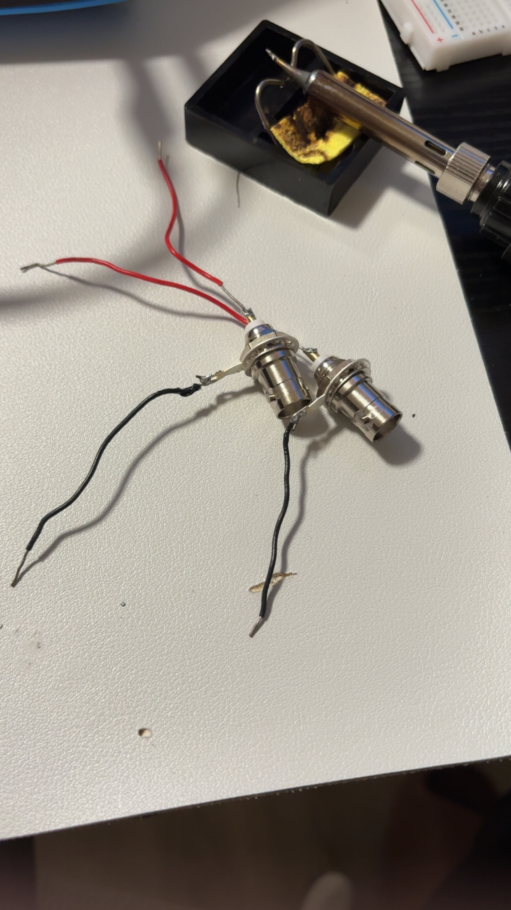

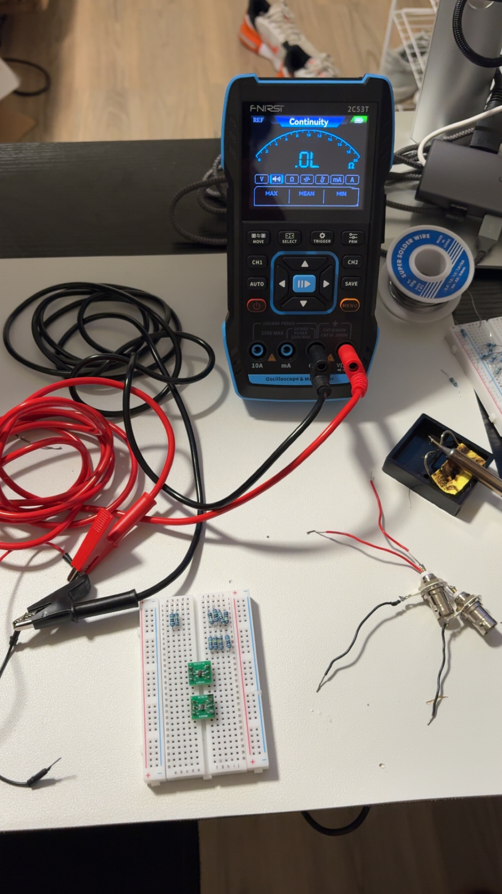

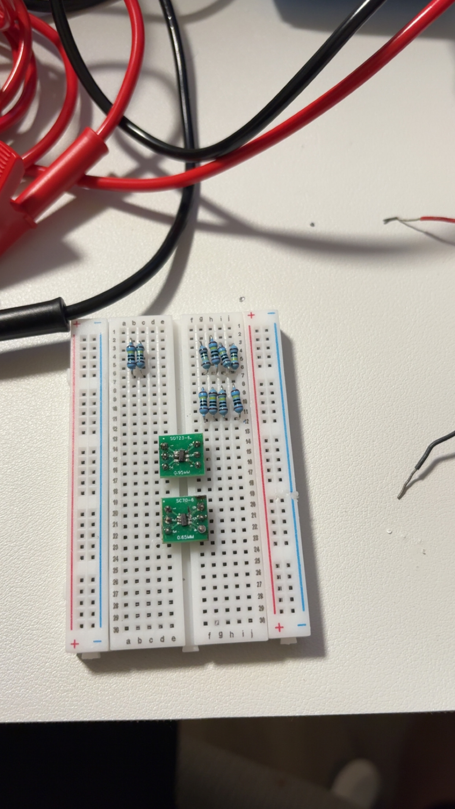

CH1 front end on the breadboard: R4 750k, R5 250k to VREF_2V2, BAV99
clamp, U3A buffer. Trimmers and the ADC filter stay off for now. Output
measured at U3 pin 1.

| Input | Expected | Measured |
|---|---|---|
| Nothing connected | 2.21 V (no current, so it sits at VREF) | 2.2 V |
| IN to GND | 1.66 V (0.75 x VREF) | 1.66 V |

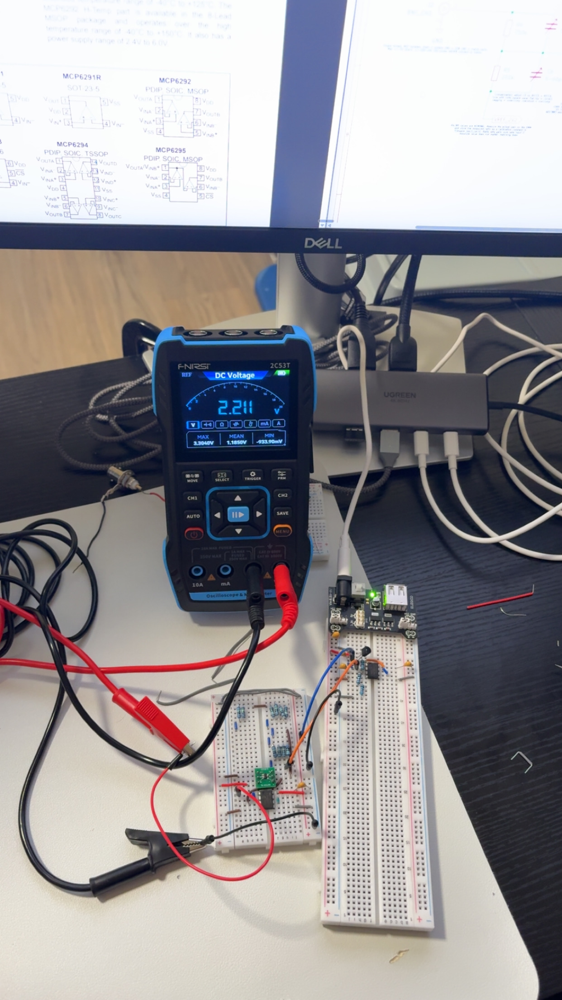

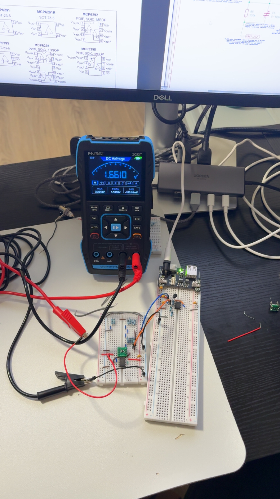

CH2 front end, same circuit: R7 750k, R8 250k to VREF_2V2, the second
BAV99, U4A buffer. Output measured at U4 pin 1.

| Input | Expected | Measured |
|---|---|---|
| Nothing connected | 2.21 V | 2.21 V |
| IN to GND | 1.66 V | 1.66 V |

Both channels match each other and the math.

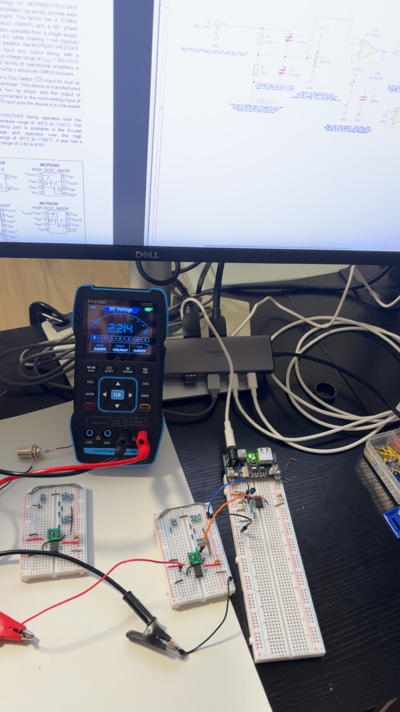

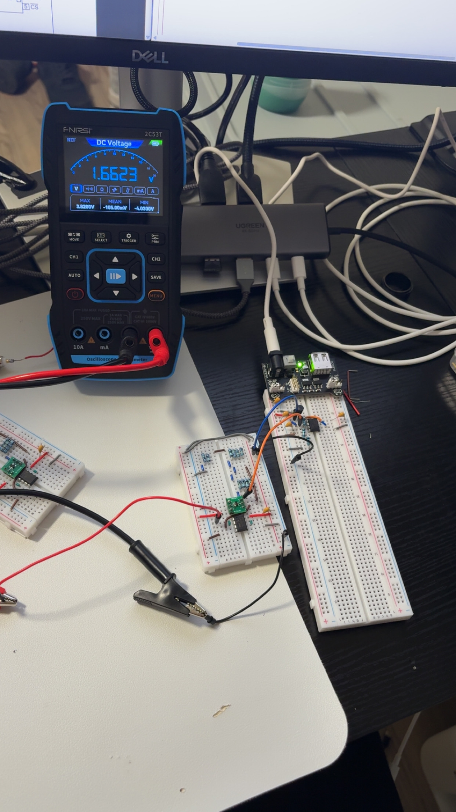

## 2026-09-25

Front panel on board 1: three LEDs and three buttons on their own
breadboard, wired to the board's headers.

Moved LED_TRIG from GPIO47 to GPIO2 first. There was no reason for it
to sit apart from the other two, and now the LEDs are on headers 39-41
right above the buttons on 36-38. Schematic, pin map and pin header
updated together.

| Part | GPIO | Header | Notes |
|---|---|---|---|
| LED_RUN (green) | 42 | 39 | 330R, active high |
| LED_TRIG (yellow) | 2 | 40 | 330R, active high |
| LED_ARM (red) | 1 | 41 | 330R, active high |
| BTN_RUN | 39 | 36 | to GND, internal 45k pull-up |
| BTN_SINGLE | 40 | 37 | to GND, internal 45k pull-up |
| BTN_GEN | 41 | 38 | to GND, internal 45k pull-up |

panel.c polls all six inputs (the three buttons plus the encoder
switches) every 1 ms and only takes a change after 20 scans in a row
agree, so bounce never gets through. Each clean press or release goes
on a FreeRTOS queue as an event. Polling instead of edge interrupts:
the 20 ms debounce sets the response time either way, and a bouncing
contact would fire dozens of interrupts per press.

The test prints every event and toggles an LED per button. One press
and one release per push, no doubles.

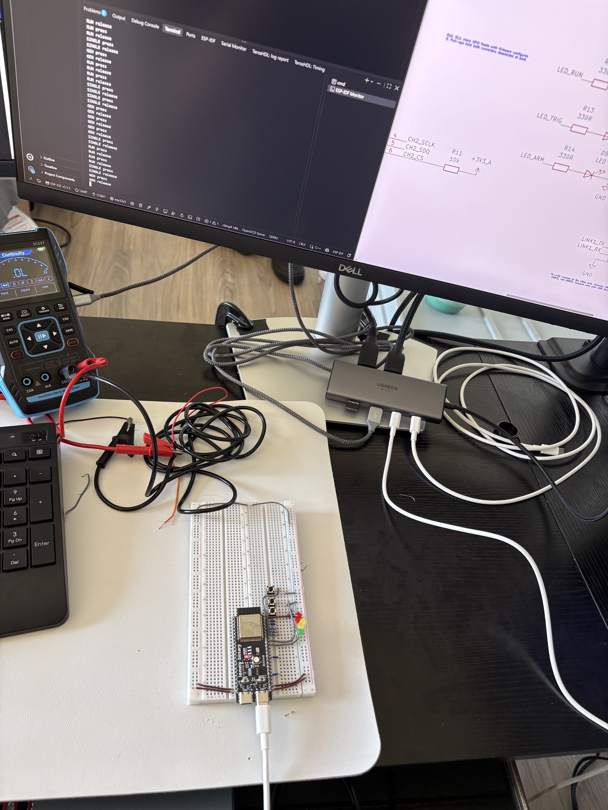

[Video: buttons toggling the LEDs](screenshots_videos/panel_buttons_leds_test.MP4)

Put the dual-line SPI decision into the schematic and pin map. Both
ADCs now share one clock and one chip select on SPI2's IO MUX pins, and
CH2's data comes in on GPIO11 (FSPID) next to CH1's on GPIO13 (FSPIQ).
The old second bus on GPIO15-17 is gone, and so is R11: one 10k pull-up
on the shared CS covers both converters.

That freed three pins right where the encoders were scattered, so the
encoders moved too. All nine encoder lines now sit on headers 4-12, one
knob after another.

| Signal | Was | Now | Header |
|---|---|---|---|
| ADC_SCLK | 12 (CH1) + 15 (CH2) | 12 | 18 |
| ADC_CS | 10 (CH1) + 17 (CH2) | 10 | 16 |
| CH1_SDO | 13 | 13 | 19 |
| CH2_SDO | 16 | 11 | 17 |
| ENC2_B | 8 | 15 | 8 |
| ENC2_SW | 9 | 16 | 9 |
| ENC3_A | 18 | 17 | 10 |
| ENC3_B | 21 | 18 | 11 |
| ENC3_SW | 38 | 8 | 12 |

Spares now 9, 14, 21, 38, 47. Nothing was wired to the old pins yet, so
this is paper only; the encoders get checked on the new pins when they
count.

Three EC11 encoders on the panel breadboard, on the new pins (headers
4-12). Each one: A and B to their GPIOs, the middle pin C to GND, push
switch between its SW GPIO and GND. Internal pull-ups, no extra parts.

The decoder is a 16-entry table indexed by the last and current A/B
state, run in the same 1 ms scan as the buttons. A legal step gives +1
or -1, no change or an illegal jump gives 0. Contact bounce toggles one
line back and forth, which reads as +1, -1, +1, -1 and cancels, so
there's no separate debounce. Four steps make one detent on these
(one full A/B cycle per click), and only whole detents become events.

One click prints enc1 +1, back prints enc1 -1, on all three knobs.
The knob presses come through the button code as ENC1-3 press/release.

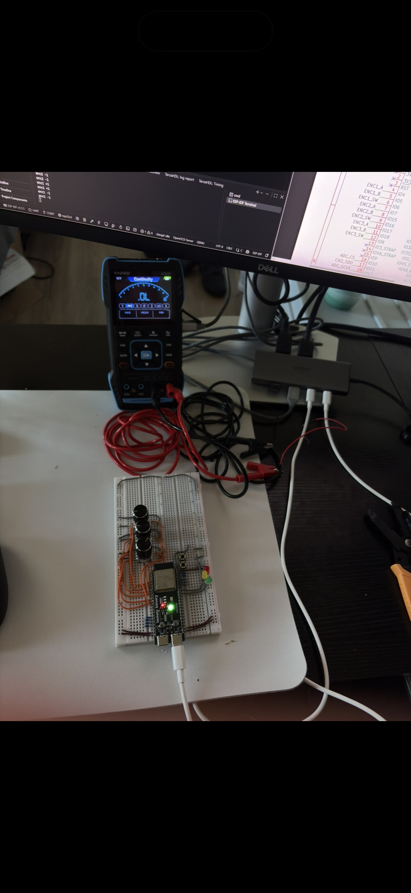

[Video: turning and pressing the knobs](screenshots_videos/panel_encoders_test.MP4)

## 2026-09-26

Soldered both ADS7883s onto SOT23-6 adapters. Took about four hours,
with no magnifier, no clamps or helping hands, and 0.8 mm solder, which
is too thick for 0.95 mm pitch. Lost two chips along the way; two made
it, which is what the design needs.

What finally worked: tin one corner pad only, hold the chip with
tweezers, reflow that blob to tack one leg, then do the opposite
corner, then the rest. Once one leg is down the chip stops moving.
Headers went on first with the breadboard as a jig, chip after.

Checks on both boards, nothing powered yet:

- Continuity from every chip leg to its header pin: all six pass.
- Adjacent pins shorted: none.
- Orientation from the diode test on the first chip: pin 2 conducts to
  every other pin with the red probe on it, so it's GND and the chip
  is the right way round.

Next time: 0.5 mm solder, tacky flux paste and fine tweezers.

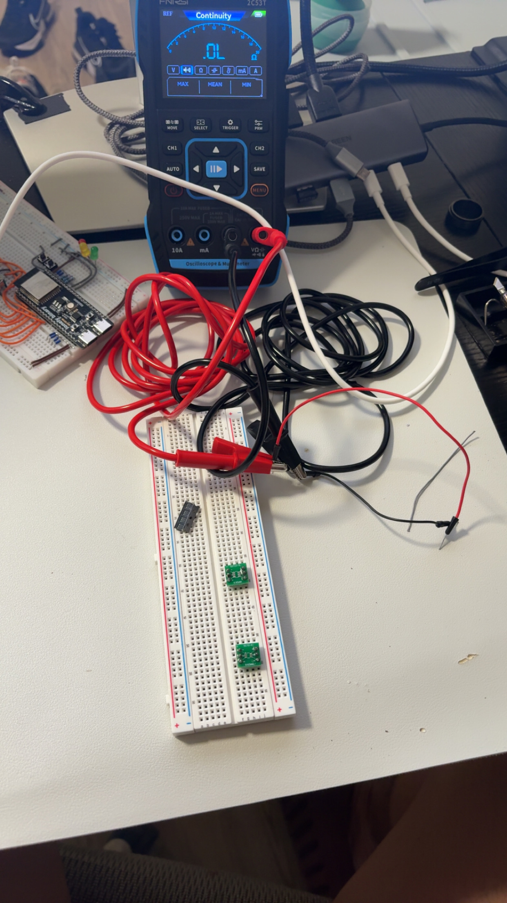

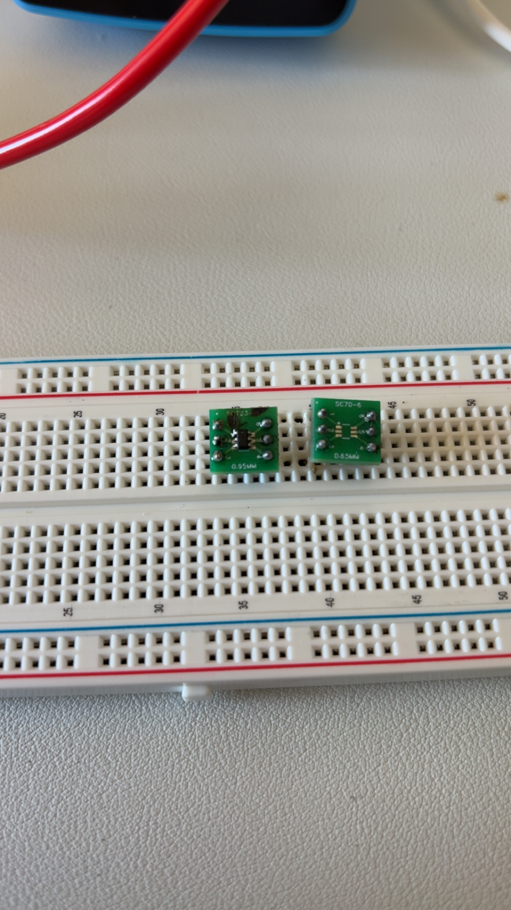

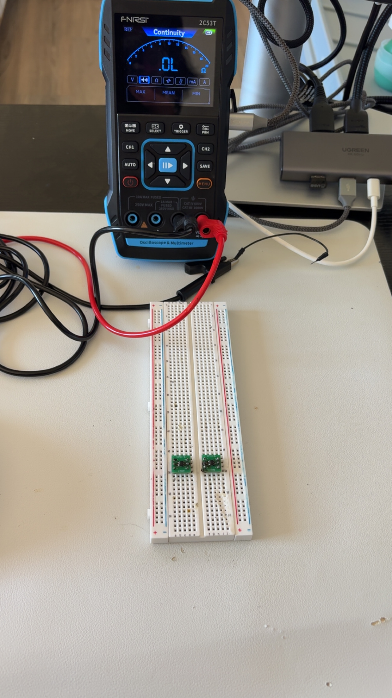

Wired both ADCs into the front ends. U6 on CH1, U7 on CH2, sharing
SCLK (IO12) and CS (IO10), data on IO13 and IO11. R6/R9 are two 330R in
parallel (165R) instead of 150R, still under the ADS7883's 200R source
limit. C8/C9 and C13/C14 (2.2 nF) are on each ADC input. Trimmers and
BNCs still off; IN is a jumper for now.

Both chips are soldered 180 degrees round on their adapters, so the
silkscreen is off by three: chip pins 1-6 are silk 4, 5, 6, 1, 2, 3.
Wired by chip pin, not silkscreen.

First read with the single-line test: code 0.0 on every frame, which
prints as -6.644 V at the BNC. The firmware checks out, and 0 is what
the ADC should report for 0 V in, so the problem is upstream. VREF
wasn't connected to the dividers at first; with that fixed, the R4/R5
junction reads 1.63 V as expected, but VIN at the ADC was still near
0 V. Swapping the two ADCs gave the same result. Still tracing.

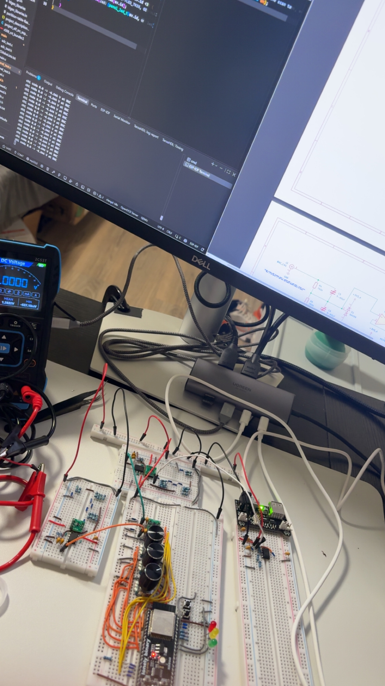

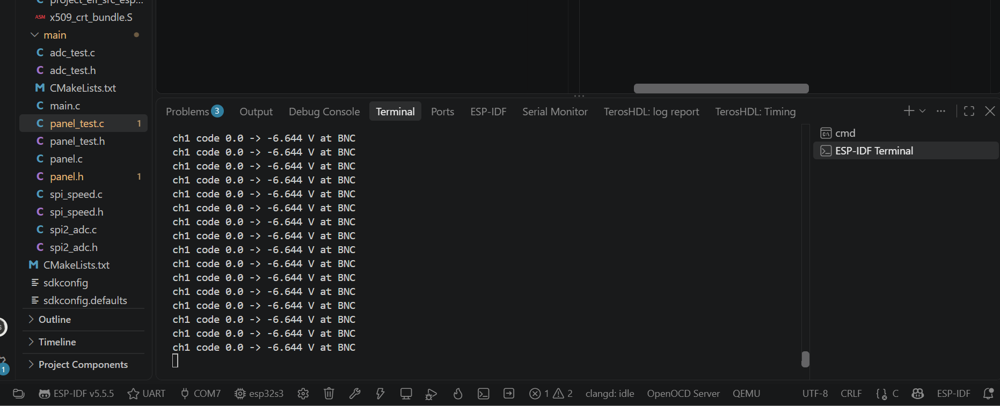

Found one: SCLK and CS were swapped on the breadboard. The ADC was being
clocked on its CS pin and selected by the clock, so it never produced a
real frame. With them swapped back the codes move off zero (about 25,
with some frames near 88), so the SPI link is alive. Still well under
the ~2000 expected for 1.63 V in, so VIN is next.

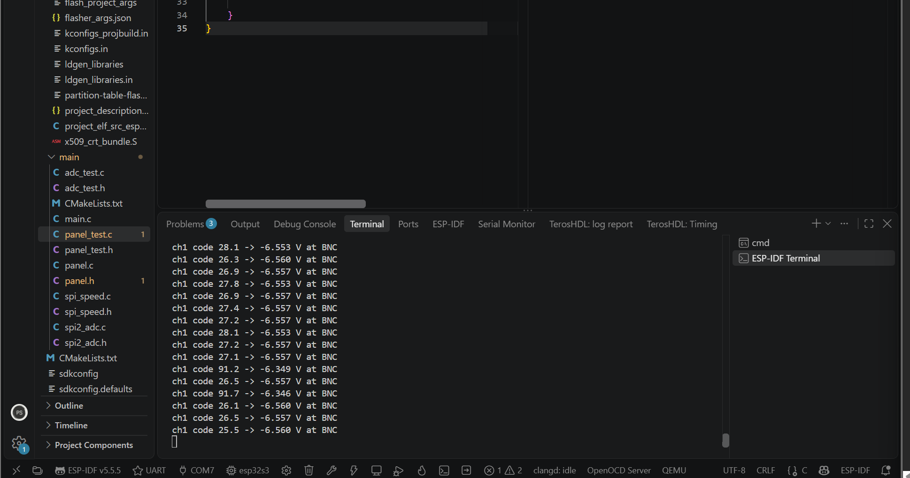

Printed every raw frame instead of the average. About a third of the
frames were wrong, and always the same way: the good code shifted left
one bit (2059 came back as 22). The ADC was one clock ahead, like it
counted an extra SCLK edge right after CS fell.

Put the logic analyzer on it. Two things in the captures: the PulseView
decoder has to match the ADC (mode 0, CS active-low) or it shows garbage
of its own, and the shifted frames were really on the wire. On a bad
frame both SDO lines flick high for about 40 ns after the first falling
edge, then drop, so both chips stepped twice on one edge.

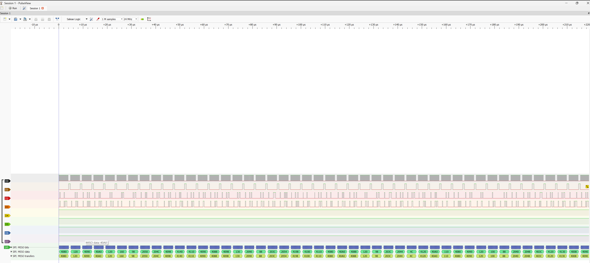

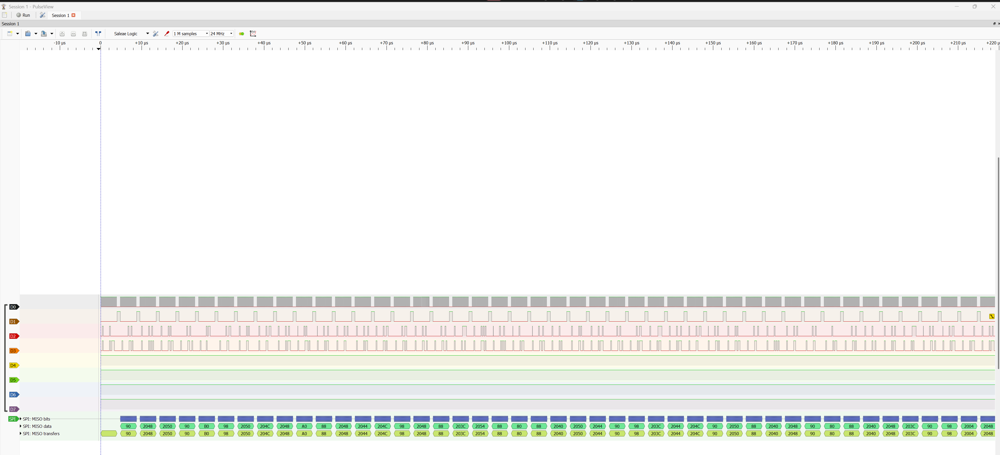

Tried, in order:

- SPI mode 1 to mode 0. No real change.
- One clock of CS setup before the first SCLK. Bad frames went from 35%
  to 9%.
- 50R in series with SCLK. Worse, about half the frames bad.
- New jumper, rerouted. Still about 40%.
- Unplugged the logic analyzer. Zero bad frames.

The analyzer was the problem. Its leads on the shared SCLK line plus its
ground going back through USB were enough to make both ADCs double
count a clock edge. The 9% run was the only one taken before it was
clipped on. Lesson: the probe is part of the circuit.

With it off: clean at 4 MHz and at 10 MHz, both channels. Checked CH2 by
moving its SDO wire onto IO13 and touching its input to VREF (code jumps
to about 2720). Kept the CS setup delay, dropped the resistor.

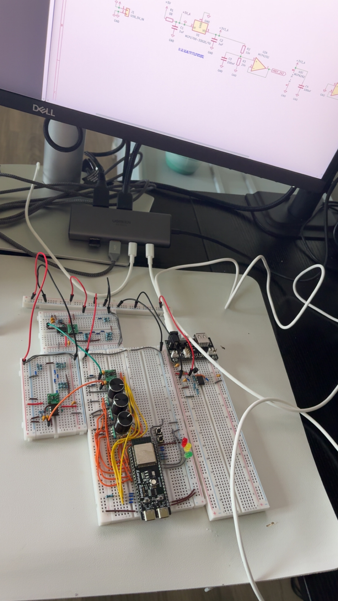

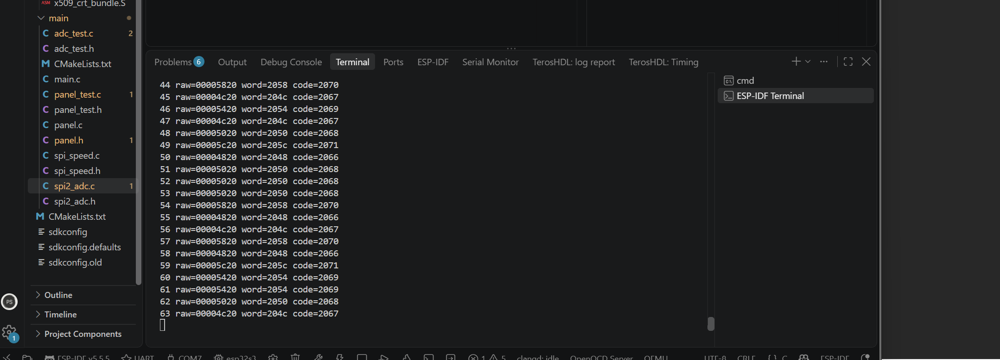

Last bit was calibration. With IN grounded the ADC reads 2067, which is
1.672 V against a 3.314 V supply, not the 1.661 V I'd assumed. Set the
offset to the measured value and the BNC reading sits at 0.001 V,
steady to one code.

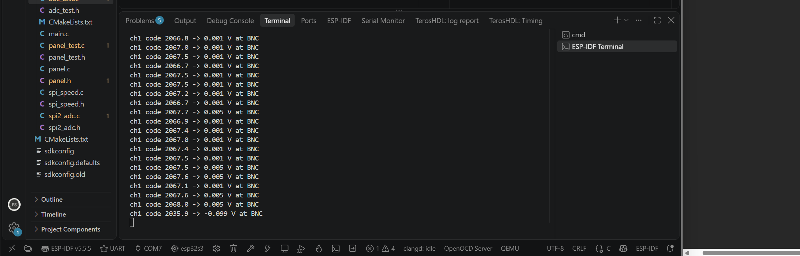

## 2026-09-27

Noise floor at full speed. SCLK at 26.67 MHz, IN grounded, 16384
samples per run, both SPI modes back to back.

Both modes were clean over about 100k samples, no bit-slips, and the
noise is the same: about 4 codes rms, 13 mV at the BNC. Went with mode 1
anyway. At this clock the ADC's data can show up 20 ns after the falling
edge, and mode 0 samples 18.75 ns after it, so mode 0 has negative
worst-case margin on paper. Mode 1 samples a full clock later.

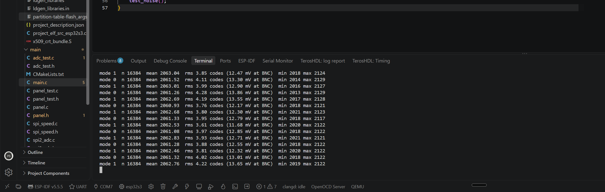

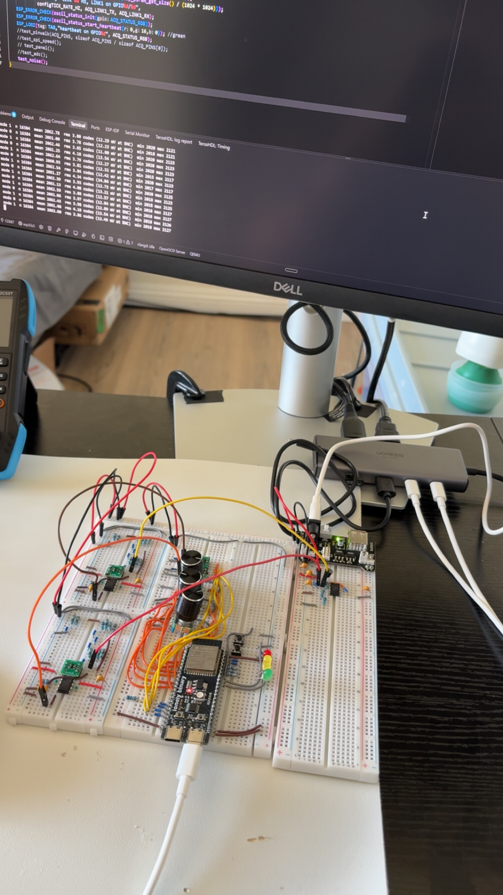

Dumped one run to the PC for a histogram. First try came back with a
third of the lines missing and one corrupted value (061 instead of
2061) that dragged the rms to 19 codes. The board was printing faster
than the USB console could drain. A 10 ms pause every 128 lines fixed
it, and the capture script now rejects anything short or malformed.

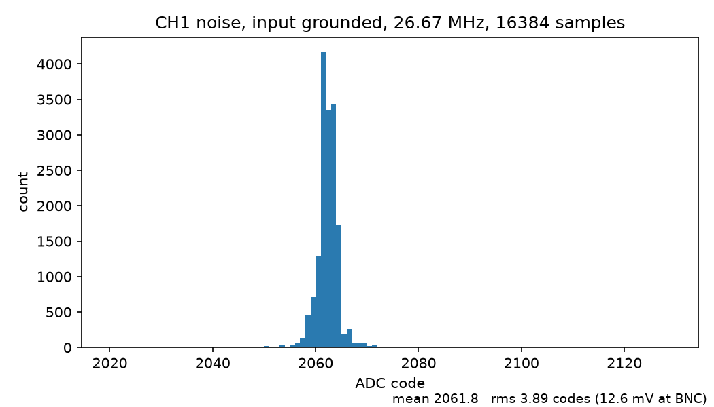

Most samples sit within 4 codes of the mean. The rms is pulled up by a
few lone samples 40 to 60 codes out, which looks like pickup on the
breadboard rather than the ADC. The filter as built (165R and 4.4 nF)
puts the corner at about 219 kHz.

The mean at 26.67 MHz is about 2062, 5 codes lower than at 10 MHz, so
the offset calibration has to be done at the speed it runs at.

Both channels in one read. The two ADCs share SCLK and CS, and CH2's
data comes in on the second SPI data line, so one 16-clock frame
brings in 32 bits with the two channels interleaved bit by bit. A
five-step shift-and-mask pulls every other bit back together.

Moved the ADC frame decoding into its own header with no ESP-IDF
includes, so the same code builds on the PC. The host test interleaves
two known words the way the hardware does and checks the fast split
against a plain bit-by-bit loop on 10,000 random pairs.

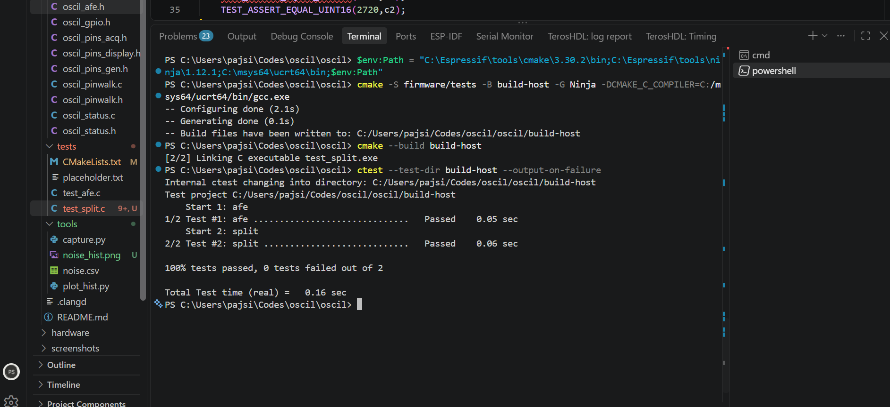

On the board, both inputs grounded at 26.67 MHz: CH1 about 2062, CH2
about 2069. The 7-code gap (about 24 mV at the BNC) is steady, so it's
an offset between the two front ends, and it gets calibrated per
channel. CH1 in the dual read matches CH1 read on its own at the same
speed, so the channels aren't swapped.

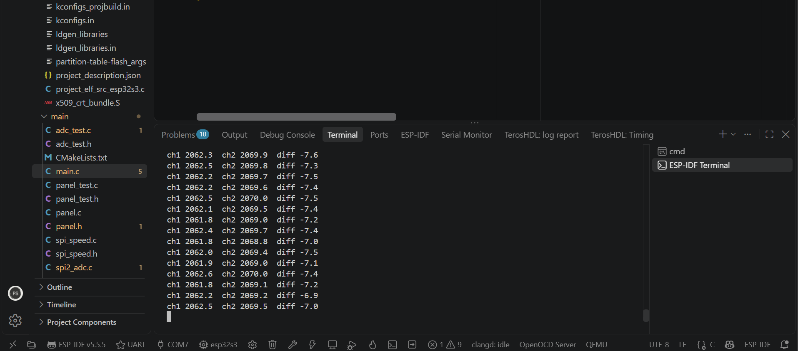

Burst capture with DMA. Until now every sample was the CPU starting an
SPI frame and waiting for it. Now the SPI block and the DMA engine run
a whole burst on their own: a list of 3200 small segments, each one a
full ADC frame, with the gap between frames set by a hardware counter
in 12.5 ns steps. The CPU starts the burst, sleeps, and gets one
interrupt at the end.

To check the timing I needed a signal I trust, so board 1 makes its
own: a 1 kHz square from the LEDC peripheral on a spare pin, jumpered
into CH1's input. Samples per period tells you the real sample rate.

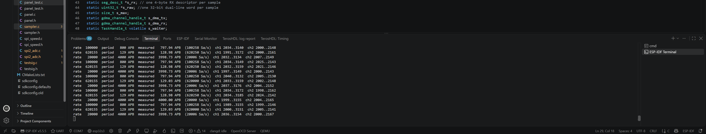

100 kSa/s measured 100.26 k, 20 kSa/s measured 20.01 k. The CS-low
part of each segment turned out much longer than the 51 clocks the
math gives, about 124 at the bus clock, because each segment also has
to load its setup from memory. That puts the ceiling at about 620 kSa/s,
not the 1.43 M I'd worked out on paper.

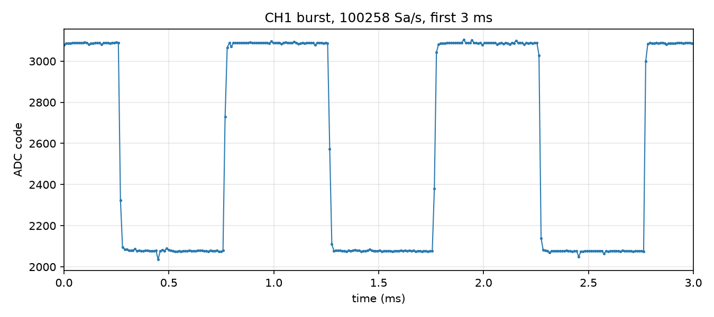

The square comes through clean, about 2075 to 3090, with an edge
spread over one or two samples from the front end and the anti-alias
filter.

Reran the noise test with all of this wired up, and this time mode 0
fell apart at 26.67 MHz: minimums down around 20 and 35 to 50 codes
rms, the same bit-slip pattern as before. Mode 1 stayed at about 4
codes. Earlier both modes were clean, so mode 0 was sitting right on
the edge, which is exactly what the timing math said. Glad I went with
mode 1.

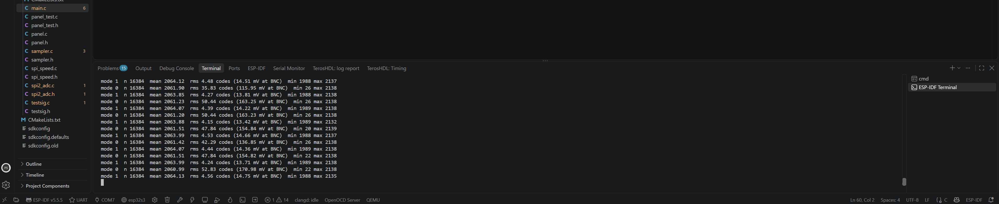

Trigger. It scans a capture for the first point where the signal
crosses a level in the chosen direction, so a repeating waveform lands
in the same place every frame instead of sliding across the screen.
Two things make it usable on real signals: hysteresis, where the signal
has to drop clearly below the level before a rising crossing counts, so
noise sitting on the level can't fire it; and a sub-sample position,
interpolated between the two samples on either side of the crossing,
so the trace doesn't jump by a whole sample from frame to frame.

It's pure C, so it's tested on the PC: exact crossing on a clean sine,
a crossing 0.3 samples between two points, chatter at the level ignored,
falling edge, and a noisy sine that still triggers once per period. All
three host test suites pass.

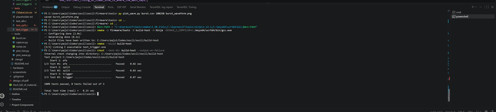

## 2026-09-28

Decimation. A capture has more samples than the screen has columns, so
each of the 800 columns has to stand for a group of samples. Averaging
or picking one sample per group would make a short glitch vanish. So
each column keeps both the lowest and the highest sample in its group,
and the screen draws a line between them. A spike one sample wide still
shows up.

Also pure C and host-tested: a one-sample spike survives, constant input
stays constant, 800 samples into 800 columns comes out unchanged, and a
ramp whose length isn't a multiple of 800 has every sample land in
exactly one column with no gaps. All four host test suites pass.

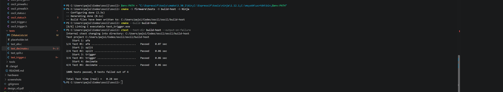

How the trigger and decimation work, drawn out: frames lining up on the
rising edge, hysteresis stopping noise at the level from firing it
again, the crossing placed between two samples, and min/max keeping a
one-sample glitch that averaging would shrink.

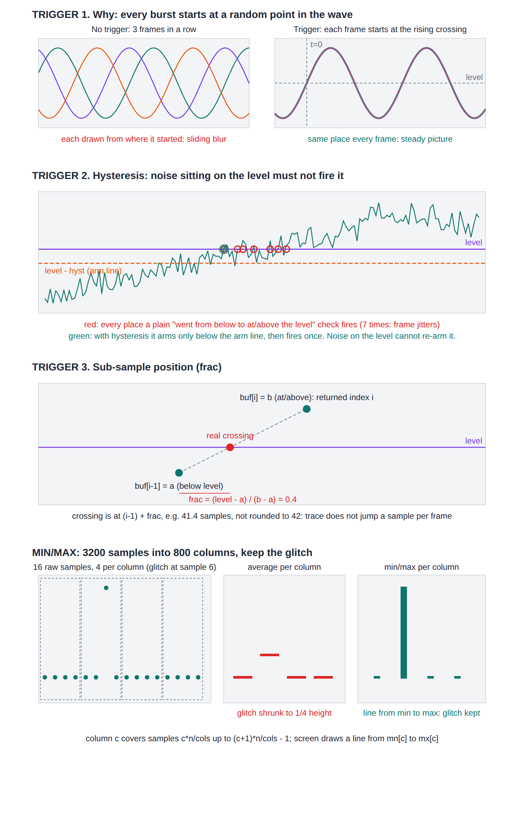

How capture actually runs. Each burst is one-shot: the CPU starts it,
the DMA fills 3200 samples on its own, the SPI block stops after the
last segment and fires one interrupt. Then the CPU triggers, decimates
and sends the frame, and only then starts the next burst. Whatever the
signal does in between is never recorded. That's dead time, and every
digital scope has it; the spec is called waveform update rate.

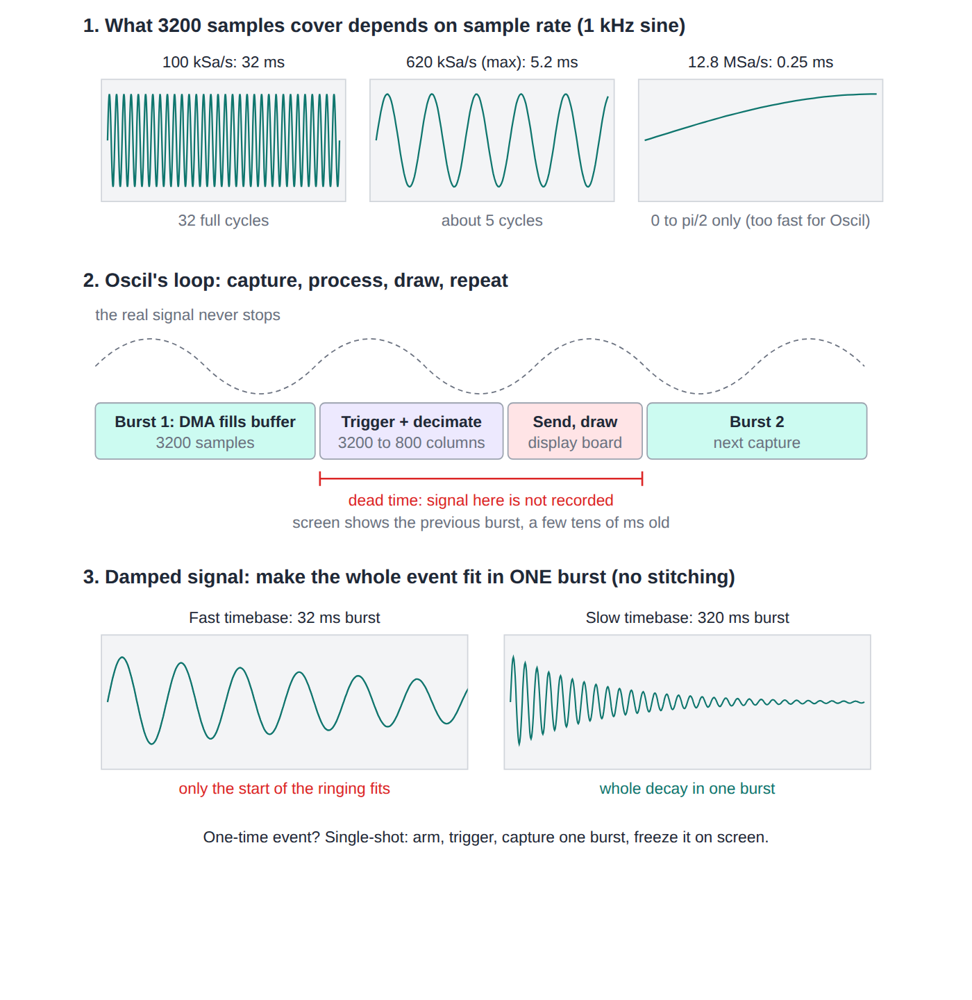

How much of the signal one burst holds depends on the ratio of signal
frequency to sample rate: cycles = f x 3200 / fs. A 1 kHz sine at
100 kSa/s is 32 cycles; at 620 kSa/s about 5. Frames are never stitched
together, so a one-time event like a damped oscillation has to fit
inside a single burst: slow the sample rate until it does, and use
single-shot so it's captured once and held.

Could the dead time go away? Checked the TRM (30.5.8.5): the segmented
transfer keeps going as long as each segment's CONF sets
usr_conf_nxt = 1, and my last segment clears it on purpose. Loop the
descriptor chains back to the start and set it everywhere, and it
should run as a continuous ring at the same data rate a burst already
proves. The catch is knowing when half the ring is full: the SPI
done interrupt only fires at the end, which never comes, and the GDMA
per-descriptor interrupt would fire on every sample. It would need a
timer or polling. And the screen only shows about 30 frames a second
out of roughly 190 bursts, so it only pays off for something like a
glitch search over every burst. Staying with one-shot for now; the
ring is a later experiment, untested.

Acquisition task. Board 1 now runs on its own: a FreeRTOS task pinned
to core 1 loops capture, trigger, min/max, and builds the frame that
will go to the display board. A settings struct under a mutex holds the
rate, trigger level, edge and source, and RUN/STOP/SINGLE, so the panel
buttons (and later the display board) can change it safely from other
tasks. AUTO mode shows an untriggered frame after three missed bursts,
so a flat line still draws instead of freezing.

Default rate is 320 kSa/s (500 us/div at 1600 samples). 800 kSa/s for
200 us/div was the plan on paper, but it's above the 620 kSa/s I
measured, so at full record length that setting is out.

With the 1 kHz bench signal on CH1: 70 frames/s, every frame triggered,
0 errors, about 2 KB of the task's 4 KB stack left. One burst is
3200 samples at 320 kSa/s, 10 ms, so the ceiling is 100 frames/s; 70
means about 4 ms per frame of trigger, decimation and re-arming the
burst, roughly 30% dead time. RUN stops and restarts with all three
LEDs following, SINGLE captures one frame and holds.

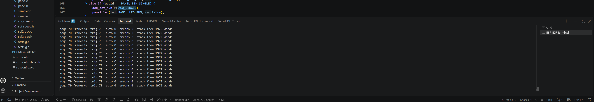

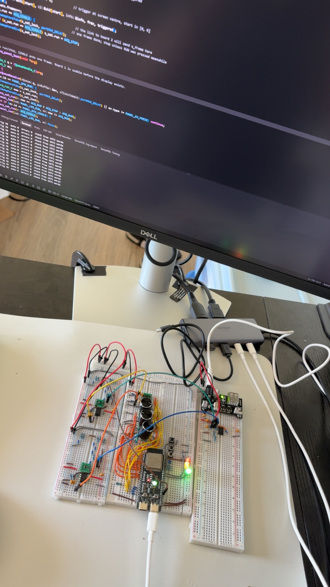

Link protocol. Board 1 has to send frames to board 2 over a UART, and a
UART only moves bytes: no message boundaries, no error check, no way to
find your place if you start listening mid-stream. Each message is now
type, sequence number, length, payload and a CRC-16, then COBS-encoded
so the byte 0x00 never appears inside it, then a single 0x00 to end it.
The receiver collects bytes until 0x00, decodes and checks the CRC;
after garbage it just waits for the next 0x00 and is back in sync. A
jump in sequence number counts as a lost frame. Pure C, host-tested: the
published CRC check value, COBS at its awkward lengths (253, 254, 255),
a flipped bit caught, garbage ignored, a missing frame counted.

UART driver, written from the registers: UART1 on GPIO43/44 through the
GPIO matrix, an interrupt handler and a ring buffer each way. Tested in
loopback, a 220R from TX back to RX on board 1, sending frames of random
length up to 7 KB at 2 Mbaud. 15,600 frames in about 4.5 minutes, every
one intact, zero CRC, length, framing, overflow or dropped-byte errors.
About 55 frames a second of 3.6 KB average, so the wire is running at
full speed. The ring buffer is host-tested too, and all six host test
suites pass.

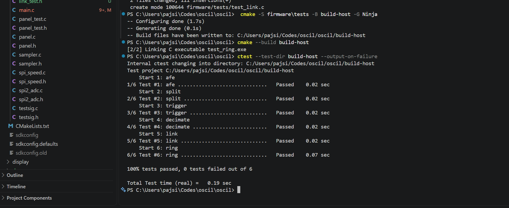

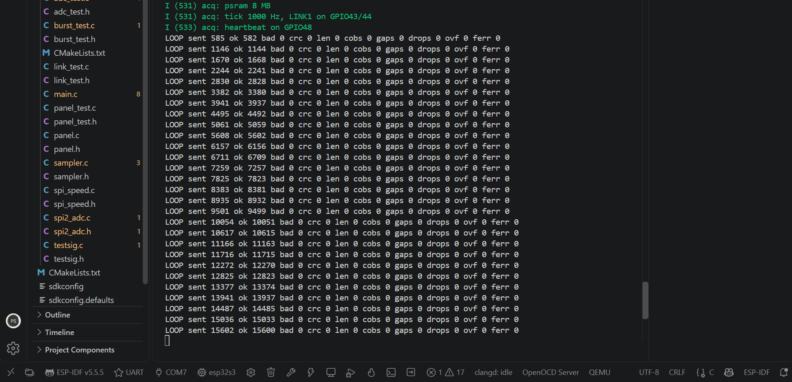

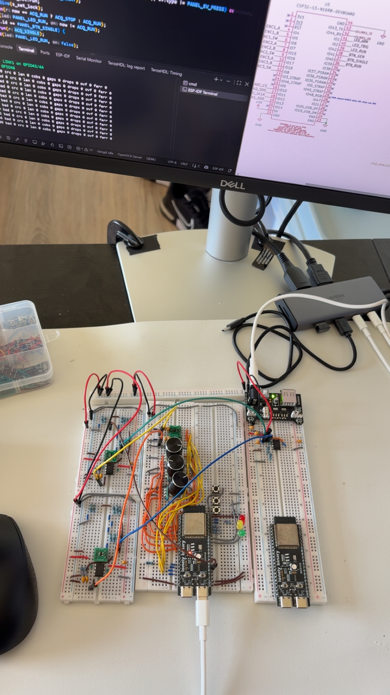

Board 1 to board 2. The two boards are now wired to each other: each
TX through a 220R to the other's RX, grounds joined. Board 1 sends every
decimated frame (a 64-byte header plus min and max for both channels,
6.5 KB) and every panel event; board 2 sends pings and settings back,
and board 1 answers settings with its run state and actual sample rate.
One shared header defines every message so all three boards agree.

About 31.8 frames/s arrive, which is what 2 Mbaud allows for 6.5 KB
frames, with zero CRC, length or dropped-byte errors. Every encoder
turn, press and release shows up on board 2. RUN reports STOP, SINGLE
reports SINGLE then STOP after one frame, and a settings change from
board 2 comes back confirmed. Ping round trip is about 40 ms because a
ping waits behind a frame that takes 33 ms to send.

The COBS and framing errors in the screenshot are from unplugging. With
one board unpowered, the other kept driving its RX pin, which back-powers
the dead chip through its pin; it then came up with a stuck USB port
until reset. The counts stay flat while both run, so no new errors. The
220R resistors are there to keep that current small. Rule for the bench:
power both boards together, or reset the one plugged in last.

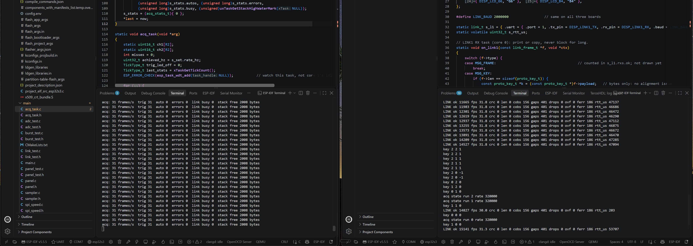

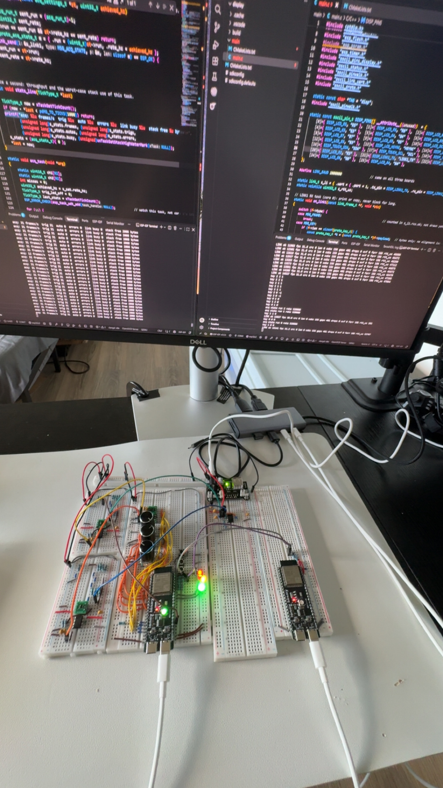

[Video: LEDs and keys with the link running](screenshots_videos/link1_leds_keys_demo.MP4)

Display prep. Soldered header pins onto the four display boards: the
Adafruit 40-pin TFT breakout for the panel ribbon, the 6-pin FPC
adapter for the touch ribbon, the XL6009 boost for the backlight and
the 5 V input. Beeped every pad against its neighbour for shorts and
against the pin it should reach. All clean.

Mapped the breakout against Adafruit's schematic before wiring anything.
The silkscreen matches this panel's RGB, clock, sync, DE and DISP pins,
but three things differ. The breakout ties ribbon pins 3 and 36 to
ground and leaves 35 open; on this panel those are the SPI chip select,
data and clock, so the panel runs its default RGB mode and the CS/SPI
tie-offs on my schematic are left out. The LA pad has a 24 V clamp
diode across the LED string for the breakout's own driver; this
backlight needs 25.6 V, so the diode comes off before the XL6009 drives
it. And 5VIN powers the breakout's boost chip, so it stays unconnected.

First fit the ribbon went in flipped and every pin came out mirrored
(pin 1 on YU). Caught it with the meter before powering anything.

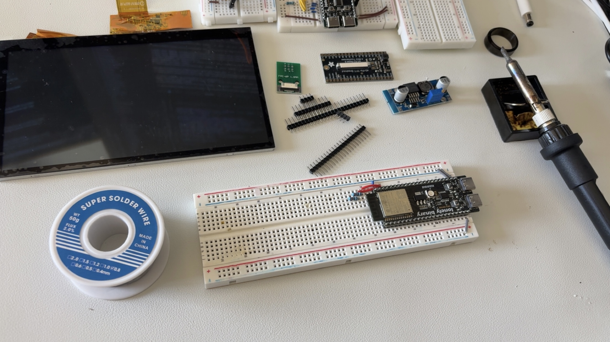

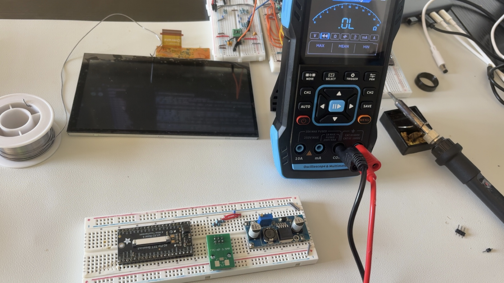

Backlight, alone. Set the XL6009 with nothing on its output first: it
turns down to about 5 V (a boost can't go below its input) and up past
22 V, so the module regulates. Parked it at 20 V, below where the LED
string turns on. Then wired OUT+ through a 100R to LA and LK to ground,
and crept the trimpot up with the meter across the resistor.

Almost no current at first, then it came up fast once the string
turned on, the knee 8 LEDs in series predict. At 25.5 V out it was
3.0 V across the 100R (30 mA). Stopped at 4.0 V across the 100R:
40 mA, two thirds of the rated 60 mA and well under the 75 mA maximum.
The booster reads 27 V, so the string drops about 23 V. Used 100R
instead of the schematic's 75R (the resistor kit has no 75R); it
dissipates 0.16 W at 40 mA, inside its rating.

The breakout's own 24 V clamp sits across the string. At 23 V it stays
below its threshold, and after a minute everything on the breakout was
cool, so it stayed on the board. Nothing else of the panel is connected
yet, so the glow is plain white.

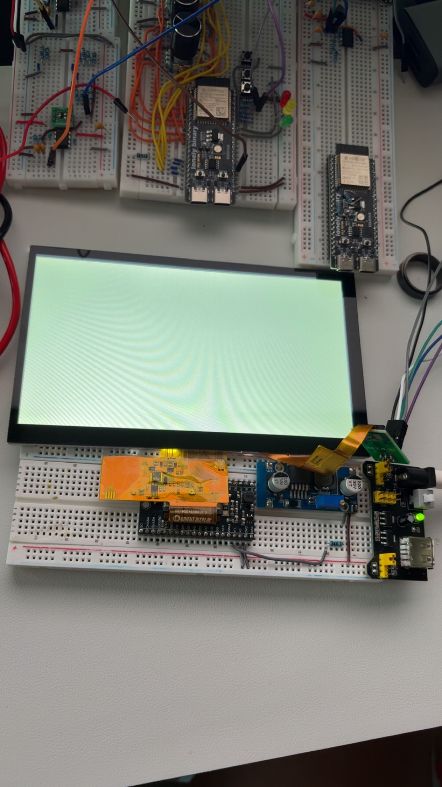

Colour bars, first attempt. Before wiring, reordered board 2's LCD pins
so the left header runs in the breakout's pad order: reds, then all five
blues, then all six greens, then the pixel clock. The LCD peripheral
reaches its pins through the GPIO matrix, so any free pin can carry any
bit; same 27 GPIOs, only the labels and the pin header changed. Wired
the 16 data lines, clock, HSYNC, VSYNC and DE, tied the unused low bits
(R0 to R2, G0, G1, B0 to B2) to ground and ON/OFF high through 10k. The
breakout already grounds the panel's SPI chip select and data pins, so
the CS/SPI tie-offs on my schematic have nowhere to go and are left
out. Touch ribbon wired too, with 2k pull-ups on SCL and SDA for margin.

The firmware side is up: the panel driver starts at 800 x 480, 16 MHz
pixel clock, 32.8 Hz refresh, and the test cycles bars, bits and border.
The panel stays plain white, which is what it shows with backlight but
no working logic. Next: DC-check the 3.3V, GND, ON/OFF, CLK (should
average about half the rail), HSYNC, VSYNC and DE pads, and reseat the
ribbon.

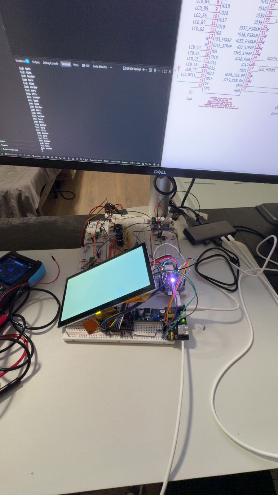

What it should show, drawn from the test code: colour bars, then one band
per data wire (dim to bright blue, green, red), then a 1-pixel border.

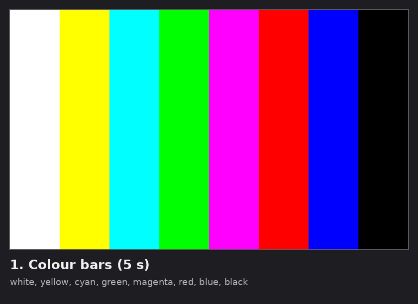

## 2026-09-29

Colour bars, fixed. The white screen was power, not signals. The panel's
3.3 V read 2.3 V off the breadboard supply, below its 2.7 V minimum, and
the supply's parts ran hot. Moving the panel to board 2's own 3.3 V (as
the schematic has it) dragged that rail to 2.2 V too, so something on
the breakout was loading it.

Adafruit's schematic explains it. The breakout's 3.3V pad is the output
of its own small regulator, whose input is 5VIN. Feeding 3.3 V into that
pad leaks back through the regulator onto 5VIN, and 5VIN also powers
the breakout's backlight boost chip, whose enable pin (PWM) is pulled up
to 5VIN. So the boost chip switched itself on and pulled hard on my
3.3 V rail. Tied PWM to ground to hold it in shutdown, left 5VIN
unconnected, and the rail holds at 3.3 V.

Now the panel's logic, touch, pull-ups and ON/OFF all run from board 2's
3.3 V, so the panel switches on and off with the board, and the backlight
stays on its own 5 V through the XL6009. Colour bars come up, and the
test cycles through the bit bands and the border.

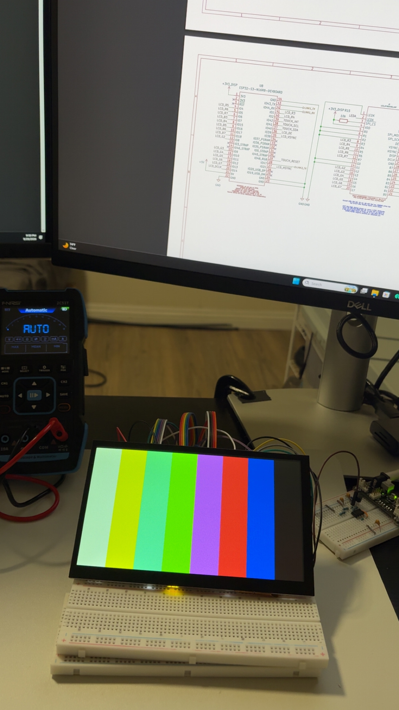

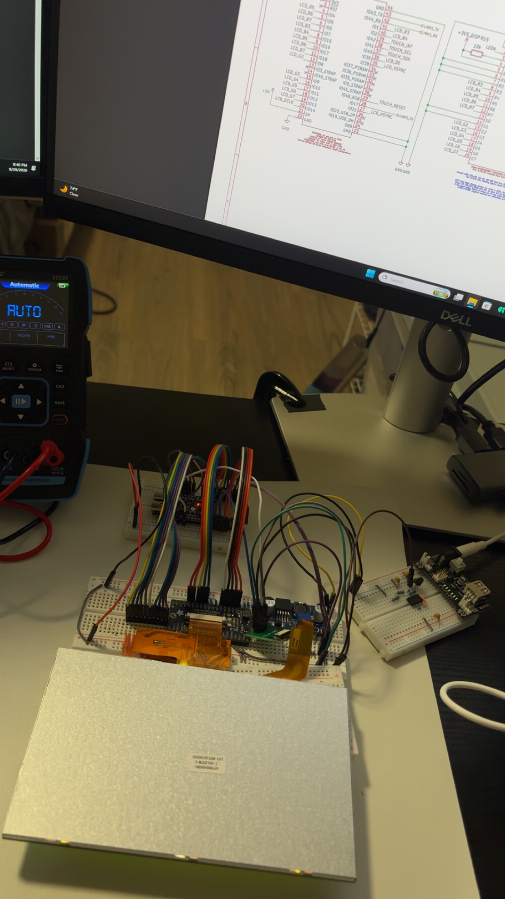

[Video: test patterns cycling](screenshots_videos/lcd_test_patterns_running.MP4)

