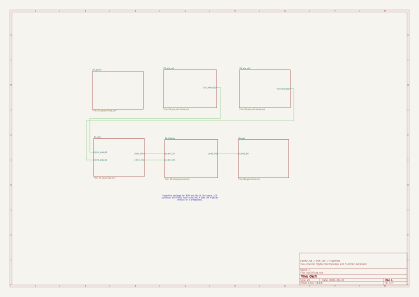
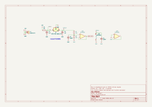
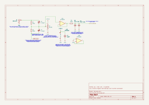
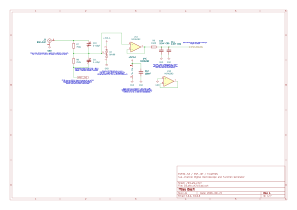
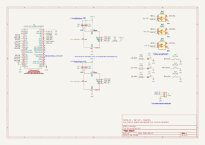
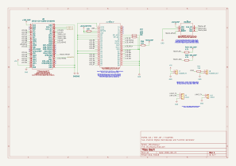
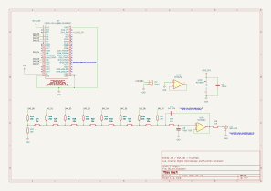

# Hardware

Rev A schematic for Oscil, drawn in KiCad 10. Three ESP32-S3 dev boards on
breadboards: one acquires, one drives the display, one generates signals.

**[Schematic PDF, Rev A](docs/Oscil-Schematic-RevA-05-Final.pdf)**
· [Pin map](docs/pin-map.md)
· [BOM](../Oscil_bill_of_materials_bom.xlsx)
· [Datasheets](datasheets/)

Status: schematic complete, ERC clean. Breadboard bring-up is next.

## Sheets

### Root

Seven hierarchical sheets. Signals cross between boards through sheet pins,
so each sheet declares its own interface. Power rails are global.

### Power

The analog side gets its own MCP1700, split off the shared 5 V, so the ADCs
never share a regulator with Wi-Fi or the display. A buffered 2.2 V
reference sets the input offset for both channels.

### Analog front end

A compensated 750k/250k divider maps ±5 V into the ADC window, a BAV99
clamps anything past the rails, an MCP6292 buffers it, and a 150 Ω + 4.4 nF
filter sits in front of the converter. The 150 Ω is set by the ADS7883's
source impedance limit (SLAS594 p.11), not by the corner frequency. Channel
2 is identical.

### Acquisition

Two ADS7883s on separate SPI hosts, so both channels sample at the same
instant rather than one after the other. Encoders, buttons and LEDs for the
front panel. Pull-ups hold both chip selects high until firmware takes over.

### Display

7" 800×480 RGB panel on a 16-bit parallel bus, GT911 touch over I²C, and an
XL6009 boost for the 25.6 V backlight. This board uses all 27 free GPIOs,
which is why the link to the generator is transmit only.

### Generator

Firmware DDS into an 8-bit R-2R ladder, then a Sallen-Key filter at about
23 kHz. The ladder's own 10k output impedance is the filter's first
resistor, so one op-amp filters and buffers.

## For Rev B

- C0G filter caps. Rev A uses a generic ceramic kit, values checked with a meter.
- A carrier board with bare WROOM-1U modules instead of dev boards.
- A gain and offset stage on the generator output. Rev A is 0 to 3.3 V only.

---
---

# Build log

Every day of this project, including the mistakes. Expand below to read
it here, or open [docs/build_log.md](docs/build_log.md).

Read the full log

## 2026-09-16

Created the KiCad project. Pushed the design docs and requirements.

## 2026-09-18

Six hierarchical sheets on the root page: power, both AFE channels,
acquisition, display, generator. 2000x1500 mils each, two rows of three.
Empty so far.

Added hardware/datasheets/ — PDFs untracked, README of links instead.
Two of the links I had were dead.

Made the project symbol library and drew the ADS7883. Pin numbers checked
against SLAS594 p.5.

Took me a while to work out that the pin X/Y is where the pin meets the
body, not the end of the stub.

## 2026-09-19

Drew the dev board symbol. 44 pins, numbered by header position with the
board in front of me.

Didn't use KiCad's built-in WROOM-1 symbol,  that's the bare module and the
header order is completely different.

GPIO35-37 are broken out on the header but the octal PSRAM uses them.
Noted on the symbol.

Drew the LCD 40-pin symbol. Was working off the 5.0 inch datasheet at first
and caught it, wrong touch controller, wrong backlight, and three pins the
7.0 inch part actually uses are NC on the 5.0.

Renamed pins 35 and 36 from SCL/SDA to SPI_SCK/SPI_MOSI. They're SPI, and
the GT911 touch I2C on the same sheet is already using those names. 

Drew the GT911 touch symbol. Six pins, same datasheet page as the LCD
connector.

## 2026-09-20

Power sheet. USB input, 0R rail split, MCP1700 to +3V3_A.

No ferrite bead in the BOM so fitted 0R instead.

2.2 V reference. 10k/20k off +3V3_A, buffered with half the MCP6292.
Tied off the spare half.

ERC needed a second PWR_FLAG after R1. The resistor splits the net so
the flag on +5V doesn't reach the other side.

VREF_2V2 as a power symbol fails ERC. Made it a global label.

BNC input on ch1. Shell to GND, centre pin is the signal.

Wrote the safety note on the sheet. The shell is system ground, which
is USB ground, which is mains earth. Not isolated.

Divider on ch1. 750k/250k off the BNC, bottom of the stack goes to
VREF_2V2 instead of GND, which is what shifts the signal into the
ADC window.

Trimmers go across each resistor, not to ground. R4*C5 = R5*C6.

BAV99 clamp on the divider junction. Pin 3 is the middle tap, the two
diodes are in series, not a common-cathode pair.

R4 is doing two jobs. It's the attenuator and it's what limits fault
current into the diodes.

Buffer on ch1. MCP6292 as a follower off the divider junction.

The divider is 188k out. The ADS7883 wants under 200 ohm, so the
buffer isn't optional.

Filter and sheet exit on ch1. 150R with two 2.2nF C0G in parallel,
241kHz corner. C0G because X7R shifts with temperature and DC bias.

Tied off U3B as a grounded follower. No-connects would have left the
inputs floating, which on a CMOS part means the output sits on a rail.

One ERC error left, CH1_ANALOG has nowhere to go until the acquisition
sheet exists.

Copied ch1 to ch2. Designators auto-incremented, but the notes carry
part numbers so those had to be retyped.

### Pin map

First pass, verified against the ESP32-S3 GPIO reference and IO MUX tables.
Check against the Lonely Binary header diagram before wiring.

### Board 1, acquisition

| Signal | GPIO | Note |
|---|---|---|
| CH1_SCLK | 12 | SPI2 IO_MUX (FSPICLK) |
| CH1_SDO | 13 | SPI2 IO_MUX (FSPIQ) |
| CH1_CS | 10 | SPI2 IO_MUX (FSPICS0), 10k pull-up |
| CH2_SCLK | 15 | SPI3, GPIO matrix |
| CH2_SDO | 16 | SPI3, GPIO matrix |
| CH2_CS | 17 | SPI3, GPIO matrix, 10k pull-up |
| ENC1_A | 4 | |
| ENC1_B | 5 | |
| ENC1_SW | 6 | |
| ENC2_A | 7 | |
| ENC2_B | 8 | |
| ENC2_SW | 9 | |
| ENC3_A | 18 | |
| ENC3_B | 21 | |
| ENC3_SW | 38 | |
| BTN_RUN | 39 | JTAG MTCK |
| BTN_SINGLE | 40 | JTAG MTDO |
| BTN_GEN | 41 | JTAG MTDI |
| LED_RUN | 42 | JTAG MTMS |
| LED_TRIG | 47 | |
| LED_ARM | 1 | |
| STATUS_RGB | 48 | onboard WS2812, driven over RMT |
| LINK1_TX | 43 | U0TXD, use UART1 |
| LINK1_RX | 44 | U0RXD, use UART1 |

Spare: 2, 11, 14

### Board 2, display and hub

| Signal | GPIO | Note |
|---|---|---|
| LCD_R3 | 1 | |
| LCD_R4 | 2 | |
| LCD_R5 | 4 | |
| LCD_R6 | 5 | |
| LCD_R7 | 6 | |
| LCD_G2 | 7 | |
| LCD_G3 | 8 | |
| LCD_G4 | 9 | |
| LCD_G5 | 10 | |
| LCD_G6 | 11 | |
| LCD_G7 | 12 | |
| LCD_B3 | 13 | |
| LCD_B4 | 14 | |
| LCD_B5 | 15 | |
| LCD_B6 | 16 | |
| LCD_B7 | 17 | |
| LCD_DCLK | 18 | |
| LCD_HSYNC | 21 | |
| LCD_VSYNC | 38 | |
| LCD_DE | 39 | JTAG MTCK |
| TOUCH_SDA | 40 | JTAG MTDO, 4.7k pull-up |
| TOUCH_SCL | 41 | JTAG MTDI, 4.7k pull-up |
| TOUCH_INT | 42 | JTAG MTMS, must be driveable |
| LINK2_TX | 47 | to board 3 |
| LINK1_TX | 43 | U0TXD, use UART1 |
| LINK1_RX | 44 | U0RXD, use UART1 |
| TOUCH_RESET | 48 | shares onboard WS2812, asserts once at startup |

Spare: none

### Board 3, generator

| Signal | GPIO | Note |
|---|---|---|
| DAC_D0 | 4 | |
| DAC_D1 | 5 | |
| DAC_D2 | 6 | |
| DAC_D3 | 7 | |
| DAC_D4 | 8 | |
| DAC_D5 | 9 | |
| DAC_D6 | 10 | |
| DAC_D7 | 11 | |
| OUT_EN | 12 | 10k pull-down, output off at boot |
| LINK2_RX | 44 | U0RXD, use UART1 |

Spare: 1, 2, 13, 14, 15, 16, 17, 18, 21, 38, 39, 40, 41, 42, 43, 47, 48

### Reserved on all three boards

| Range | Why |
|---|---|
| 26-32 | SPI flash |
| 33-37 | octal PSRAM (N16R8) |
| 19-20 | native USB Serial/JTAG |
| 0, 3, 45, 46 | strapping |

Leaves 27 usable: 1, 2, 4-18, 21, 38-44, 47, 48.

LINK2 is TX only. Board 2 sends generator settings and gets nothing back.
That is what makes board 2 fit in 27 pins.

Every GPIO comes out of reset as an input with no pull. Both ADC chip
selects need a 10k pull-up so the converters are deselected before firmware
runs, and OUT_EN needs a 10k pull-down so the generator output is off at
boot.

GPIO39-42 are the external JTAG pins. Using them as GPIO means no external
JTAG adapter. The built-in USB JTAG does not use them, so debugging over
USB is unaffected.

GPIO43/44 are UART0's default pins. Route the inter-board links through
UART1 and put the console on USB Serial/JTAG
(CONFIG_ESP_CONSOLE_USB_SERIAL_JTAG), or the boot log goes out the link
cable. UART0 download mode is gone either way.

Board 3 DAC_D0-D7 sit on GPIO4-11, contiguous inside the GPIO_OUT register
(GPIO0-31). All eight bits write in one masked register write. Keep them in
that range if this gets rearranged.

GPIO48 is the onboard WS2812, an addressable LED, not a plain one. On board
1 it is the status LED. On board 2 it shares TOUCH_RESET, which asserts once
at startup, so the LED stays quiet.

## 2026-09-21

Acquisition sheet. Both ADS7883s on separate SPI hosts, encoders,
buttons, LEDs, LINK1 header.

Pull-ups on both CS lines. Every GPIO floats until firmware sets it
up, so without them the ADCs could think they're selected at boot.

Display sheet. RGB565 bus to the 7 inch panel, GT911 touch,
XL6009 for the backlight.

Panel is 24-bit, only the top 16 bits are driven. Tied the other
eight low. Panel SPI tied off too, no pins left on board 2.

Board 2's 3V3 regulator feeds the panel and touch, not +3V3_A.

Crossed LINK1 on the root sheet by pin order, TX opposite RX, so
the wires run straight.

Generator sheet. 8-bit R-2R ladder off GPIO4-11, Sallen-Key filter,
51R out to the BNC.

The ladder's own 10k output impedance is the filter's first resistor,
so one op-amp does filter and buffer.

Dropped OUT_EN from the pin map. Nothing to switch, and the ladder
already sits at 0V at boot through the terminator.
