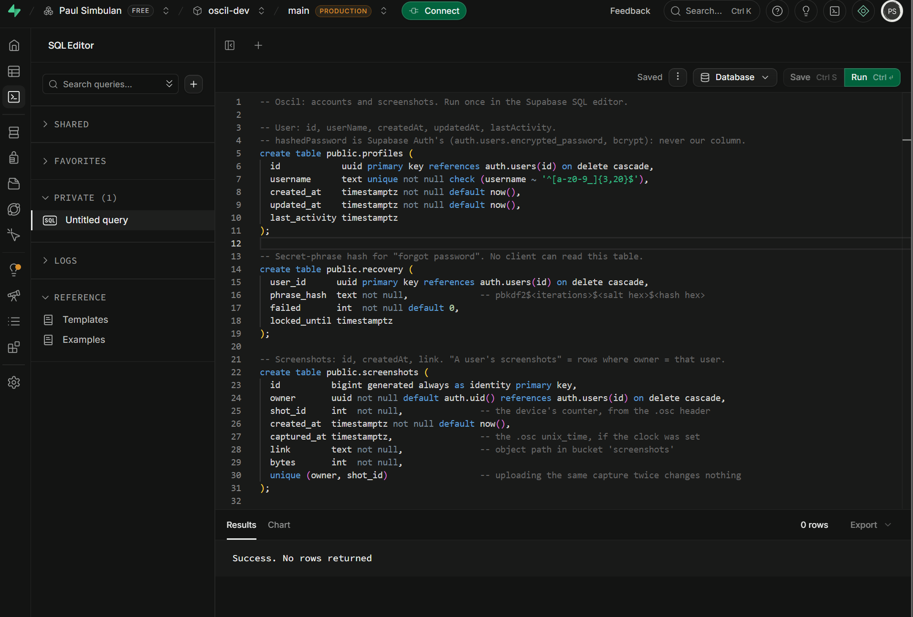
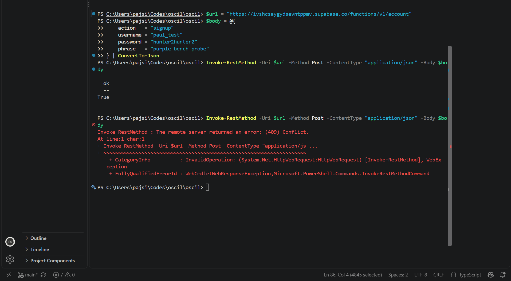
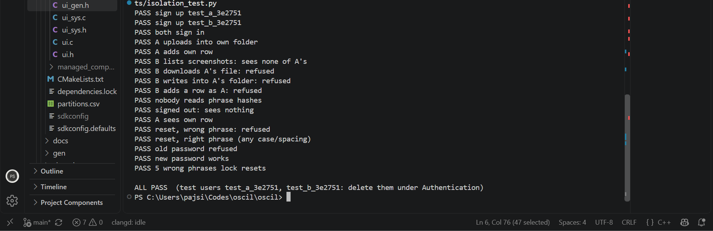

# Software build log

## 2026-10-03

Created `oscil-dev` in Supabase, in West US. Email sign-in is enabled,
confirmation is off. The device uses local account addresses that cannot
receive mail.

Applied `schema.sql` in the SQL editor. Supabase returned "Success. No rows
returned." The script creates `profiles`, `recovery` and `screenshots`, enables
row-level security, and creates a private screenshots bucket with a 64 KiB
file limit. Profile and screenshot policies restrict access to the signed-in
owner. Recovery has no client policies and its client grants are revoked.

The SQL is saved in the repo. The successful query confirms setup;
account and isolation checks were run separately below.

Deployed the `account` Edge Function from `index.ts`, with Verify JWT off.
The source uses Supabase's server-side service-role key to create the Auth
user, profile and recovery hash. The secret phrase is normalised and hashed
with PBKDF2-SHA256, a random salt and 100,000 iterations.

Tested signup from PowerShell with `paul_test`. The first request returned
`ok: True`. Repeating it returned HTTP 409 Conflict, rejecting the duplicate
username. Password reset, lockout and cross-account isolation were checked
with the two-user test below.

Ran `tests/isolation_test.py` against `oscil-dev`. All 17 checks passed.
Both users could sign up and sign in. A uploaded a file and added its row;
B could not list or download it, write into A's folder, or insert a row as A.
The signed-out request returned no screenshots, and the recovery hash read
was refused. A could still read its own row.

Password reset refused the wrong phrase and accepted the right phrase with
different case and spacing. The old password stopped working, the new one
worked, and five wrong phrases locked further resets.

The PC's `python` command first resolved to MSYS2. Used Windows Python 3.13,
installed `requests` there, and set the Supabase URL and publishable key in
the PowerShell environment. The final run returned `ALL PASS`.

Raised the screenshots bucket limit from 64 KiB to 2 MB for the device's
800 x 480 BMP photos (1,152,054 bytes each). The change is saved in
`schema.sql`; the bucket stays private with the same owner policies.
